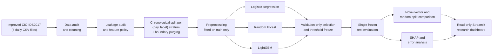
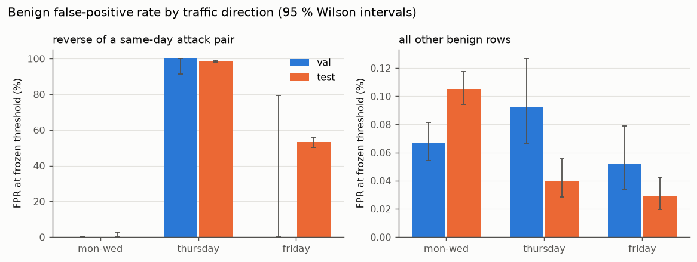
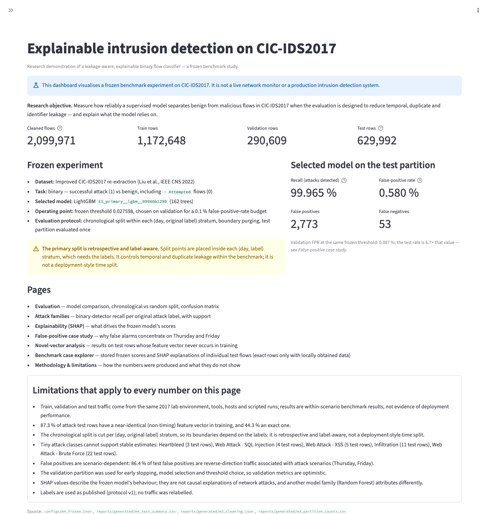
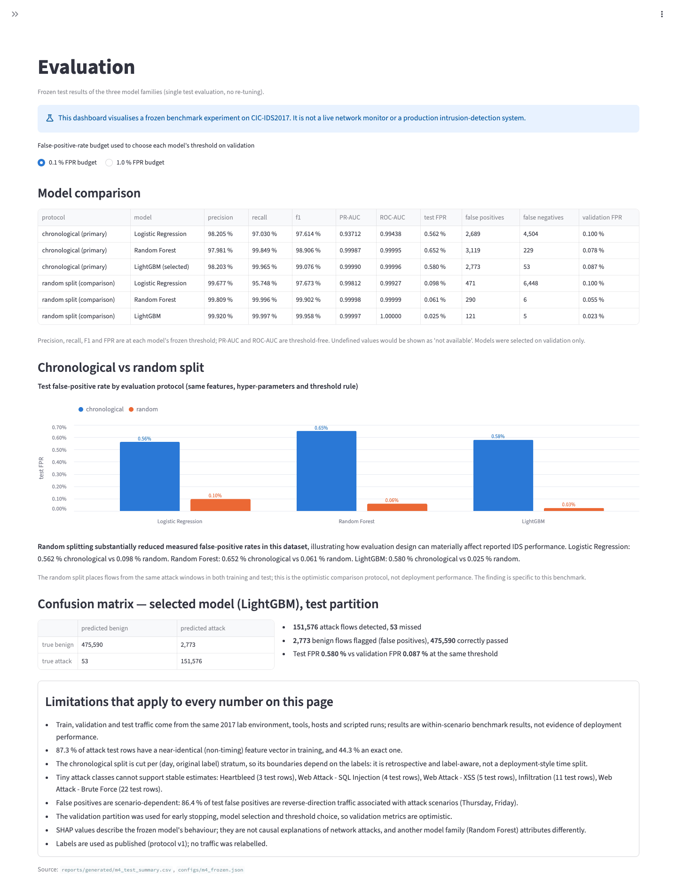
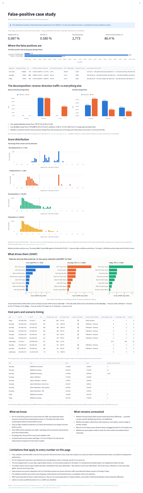
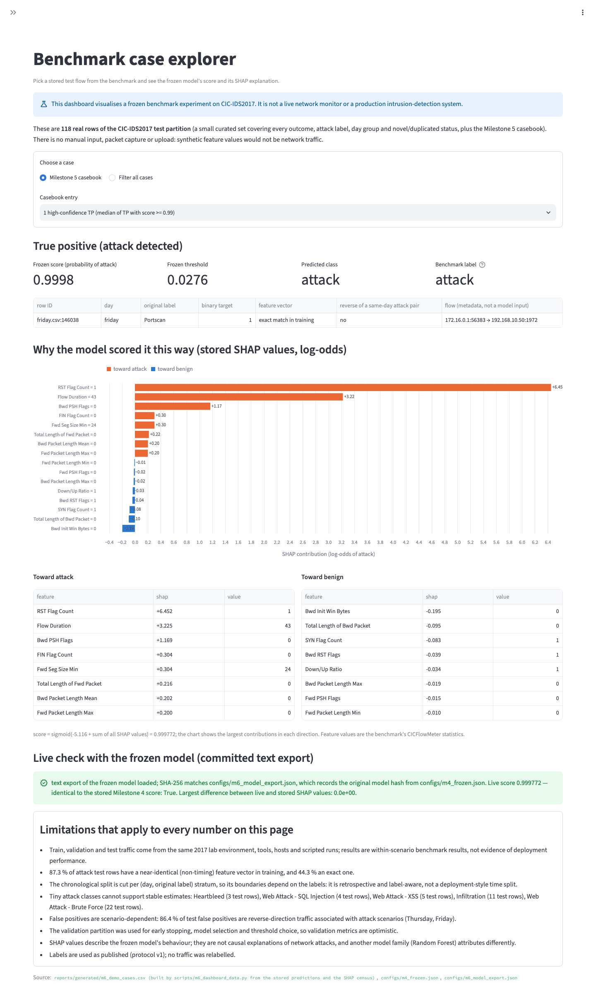

# Explainable Machine-Learning Intrusion Detection under Leakage-Aware Evaluation

 

A study of supervised flow-based intrusion detection on the improved CIC-IDS2017 dataset. It uses a leakage-aware chronological evaluation, per-attack-family analysis, SHAP explanations of the frozen model and a read-only research dashboard.

> This is a benchmark study on a 2017 lab dataset. It is not a production intrusion-detection system, it does not monitor live traffic, and its results do not show how a detector would behave on another network.

<!-- Generated by scripts/render_readme.py from configs/*.json and reports/generated/*. Do not edit by hand. -->

## Why this project

Intrusion-detection results on public benchmarks are often reported under random train/test splits. In flow datasets, those splits can put near-identical flows from the same attack burst into both training and test, which makes results look better than they are. In security, the false-positive rate matters as much as detection: an alert rate that looks small on benign traffic is still a large number of alerts. This project asks how a standard detector performs when the evaluation is designed to limit temporal, duplicate and identifier leakage, and what the model's decisions rest on. The conclusions apply to this dataset and protocol only.

## Key findings

All values are from the single frozen test evaluation (protocol v1, LightGBM selected on validation, threshold fixed on validation for a 0.1 % false-positive-rate target).

1. **High attack recall on the chronological test set.** The selected LightGBM model detected 151,576 of 151,629 test attack flows (recall 0.99965, 53 missed).
2. **The validation false-positive target did not hold on test.** Validation FPR at the frozen threshold was 0.087 %; test FPR was 0.580 % (2,773 false positives on 478,363 benign test flows).
3. **The chronological split gave a much higher FPR than a random split.** With the same features, hyper-parameters and threshold rule, the random-split LightGBM model had a test FPR of 0.025 % (121 false positives). The same direction holds for all three model families ([below](#chronological-vs-random-split)).
4. **Most test false positives are reverse-direction traffic from attack scenarios.** 2,395 of 2,773 false positives (86.4 %) are flows whose source and destination are the reverse of a same-day attack pair. These make up 0.65 % of benign test flows, and 77.1 % of them were flagged.
5. **The remaining benign traffic stays close to the intended budget.** Excluding those flows, benign FPR was 0.080 % on test against 0.068 % on validation.
6. **The model leans heavily on a few flow-level features.** `RST Flag Count` carries 39.5 % of the total mean absolute SHAP value over the test set. The top five are `RST Flag Count`, `Bwd PSH Flags`, `Flow Duration`, `Bwd Init Win Bytes`, `Bwd Packet Length Std`. A Random Forest trained on the same data ranks features differently (top-10 overlap 0.5).
7. **Novel-vector performance stays high, but that subset has a different attack mix.** On the 511,247 test rows whose feature vector never appears in training, recall is 0.99937 and FPR 0.645 %. Scans make up 45.7 % of attack rows in the full test set but only 2.4 % in the novel subset, so the two numbers are not directly comparable.

## Pipeline



## Evaluation methodology

| Step | What was done | Details |
|---|---|---|
| Dataset | Improved CIC-IDS2017 re-extraction (Liu et al., IEEE CNS 2022); 2,099,976 flows, 5 days | [`DATA_CARD.md`](DATA_CARD.md) |
| Data audit | Schema, labels, timestamps, duplicates, non-finite values; 5 rows with infinite rates removed, leaving 2,099,971 | [`reports/DATA_AUDIT.md`](reports/DATA_AUDIT.md) |
| Leakage audit | Identifier, temporal, duplicate and shortcut-feature risks measured before any model was trained | [`reports/LEAKAGE_AUDIT.md`](reports/LEAKAGE_AUDIT.md) |
| Feature policy | IPs, ports, timestamps, flow IDs and label-derived columns are never model inputs; frozen manifest | [`configs/feature_manifest_v1.json`](configs/feature_manifest_v1.json) |
| Split | Chronological within each (day, original label) stratum: train 1,172,648, validation 290,609, test 629,992 | [`reports/EXPERIMENT_PROTOCOL.md`](reports/EXPERIMENT_PROTOCOL.md) |
| Purging | 6,722 train/validation rows whose flow interval reaches into the next partition removed; test rows are never removed | same |
| Tuning | Hyper-parameters, model selection, early stopping and thresholds use validation data only; the selection rule was written before training | [`configs/model_selection_v1.json`](configs/model_selection_v1.json) |
| Threshold | Frozen per model on validation for 0.1 % and 1 % FPR targets | [`configs/m4_frozen.json`](configs/m4_frozen.json) |
| Test-once | The test partition was evaluated once; model files are hash-checked before evaluation | [`reports/MODEL_EVALUATION.md`](reports/MODEL_EVALUATION.md) |
| Novel-vector subset | Test rows whose exact feature vector does not occur in training | protocol §7 |
| Random-split comparison | Same stratum sizes, features and hyper-parameters, random assignment | model evaluation §12 |
| Per-family evaluation | Binary-detector recall per original attack label with Wilson intervals | model evaluation §11 |

**The split is retrospective and label-aware.** Split points are placed inside each (day, label) stratum, which requires the labels. This controls temporal and duplicate leakage within the benchmark. It is not a deployment-style time split, and all attack types are present in training.

## Model comparison

Chronological test partition, 0.1 % FPR operating point (thresholds chosen on validation):

| Model | Precision | Recall | F1 | FPR | FP | FN | PR-AUC |
|---|---|---|---|---|---|---|---|
| Logistic Regression | 0.98205 | 0.97030 | 0.97614 | 0.562 % | 2,689 | 4,504 | 0.93712 |
| Random Forest | 0.97981 | 0.99849 | 0.98906 | 0.652 % | 3,119 | 229 | 0.99987 |
| LightGBM (selected) | 0.98203 | 0.99965 | 0.99076 | 0.580 % | 2,773 | 53 | 0.99990 |

Validation could not separate the two tree models; LightGBM was selected by the predeclared PR-AUC tie-break. Logistic Regression misses most flows of several attack labels. Per-label results are in [`reports/MODEL_EVALUATION.md`](reports/MODEL_EVALUATION.md) §11.

## Chronological vs random split

Test FPR at each model's frozen 0.1 %-target threshold:

| Model | Chronological split | Random split | Validation FPR (chronological) |
|---|---|---|---|
| Logistic Regression | 0.562 % (2,689 FP) | 0.098 % (471 FP) | 0.100 % |
| Random Forest | 0.652 % (3,119 FP) | 0.061 % (290 FP) | 0.078 % |
| LightGBM | 0.580 % (2,773 FP) | 0.025 % (121 FP) | 0.087 % |

In this dataset, the random split produced much lower measured false-positive rates for every model family. The random split puts flows from the same attack windows into both training and test. It is the more optimistic protocol here, and its numbers should not be read as deployment performance. This result is specific to this benchmark and protocol.

## Explainability and false-positive analysis

TreeSHAP was computed for every one of the 629,992 test rows (LightGBM, log-odds output; additivity verified on all rows).

- **Global drivers.** `RST Flag Count` alone carries 39.5 % of mean |SHAP|. By feature group: TCP flags 54.0 %, timing 13.8 %, response sizes 12.7 %, TCP window 7.2 %. Several influential features, such as the victim's initial TCP window, plausibly describe the lab's servers and tools rather than attack behaviour. This is a hypothesis, not an established fact.
- **Where the false positives are.** They concentrate on two days:

| Test day group | Benign flows | False positives | FPR |
|---|---|---|---|
| Monday–Wednesday | 303,528 | 319 | 0.105 % |
| Thursday | 87,052 | 1,800 | 2.068 % |
| Friday | 87,783 | 654 | 0.745 % |

- **Reverse-direction cluster.** On Thursday and Friday, most false positives are short, reset-terminated flows going *from* hosts that were scanned or attacked *to* the attacker. The model scores them the way it scores scan traffic. The dataset's labelling rules match the attacker as source, so these flows are labelled benign. The per-stratum split puts most of them in the test window: validation has only 42 such benign rows on Thursday and Friday, and training on Thursday and Friday has almost none.
- **What is not claimed.** These rows are "false positives under the benchmark labels". The analysis does not claim that they are mislabelled, and no label was changed (protocol v1). Why only about half of the Friday reverse flows are flagged is unresolved. Whether the pattern holds for other fits of the same model was not tested.
- **Model disagreement.** A Random Forest on the same data attributes differently (top-10 overlap 0.5, rank Spearman 0.65). SHAP describes one fitted model; it is not a causal account of network attacks.



Full analysis: [`reports/EXPLAINABILITY_ANALYSIS.md`](reports/EXPLAINABILITY_ANALYSIS.md) (§8–9 false positives, §17 validation→test shift) and [`MODEL_CARD.md`](MODEL_CARD.md).

## Research dashboard

A read-only Streamlit app with 8 pages. It shows the frozen results, per-family recall, SHAP explanations, the false-positive case study, the novel-vector analysis and a case explorer. It is a benchmark and research interface: it does not capture, scan or generate traffic, and it is not a monitoring tool. Every displayed value is read from committed artifacts, and a test fails if a number is typed into a page.

```bash
.venv/bin/python -m streamlit run dashboard/app.py
```

| | |
|---|---|
|  |  |
| Overview | Evaluation: model comparison, chronological vs random split |
|  |  |
| False-positive case study | Benchmark case explorer |

### Benchmark case explorer and the committed model export

The case explorer shows stored test rows with the frozen score and SHAP explanation. It can also recompute both live from [`dashboard/model/E1_primary__lgbm__99966b1299.txt`](dashboard/model/E1_primary__lgbm__99966b1299.txt), a 1,131,901-byte LightGBM text export of the frozen selected model. This file was not retrained and is not a new model:

- it is a deterministic export of the frozen model file recorded in [`configs/m4_frozen.json`](configs/m4_frozen.json) (unchanged);
- its SHA-256 (`898a58b090ca36f9…`) is recorded in [`configs/m6_model_export.json`](configs/m6_model_export.json), and the dashboard loads it only if the hash matches;
- its scores are bit-identical to the frozen model on all 629,992 test rows, and its SHAP values are bit-identical on all 118 explorer cases.

Without the export, the explorer falls back to the stored scores and SHAP values. See [`dashboard/README.md`](dashboard/README.md).

## Repository structure

```
├── README.md, PROJECT_PLAN.md, DATA_CARD.md, MODEL_CARD.md
├── configs/          frozen protocol-v1 configs, model-selection rule, frozen model record, export record
├── src/ids/          data loading, preparation/splitting, preprocessing, modelling, metrics, SHAP helpers
├── scripts/          pipeline entry points (audit → prepare → train/evaluate → explain → render) and git hook
├── reports/          audit, protocol, evaluation and explainability reports
│   ├── generated/    machine-readable tables behind every reported number
│   └── figures/      SHAP/error-analysis figures (m5) and dashboard screenshots (m6)
├── dashboard/        Streamlit app, data layer and the frozen-model text export
├── data/             download instructions and provenance record (the data itself is not committed)
└── tests/            unit, consistency and dashboard tests
```

## Installation

Requires Python 3.12 and [uv](https://docs.astral.sh/uv/). Direct dependencies are pinned in [`requirements.txt`](requirements.txt).

```bash
git clone https://github.com/Vanshcloud/Intrusion-Detection-System.git
cd Intrusion-Detection-System
uv venv --python 3.12 .venv
uv pip install --python .venv -r requirements.txt
.venv/bin/python -m pytest                          # tests needing the dataset or local artifacts are skipped
.venv/bin/python -m streamlit run dashboard/app.py  # opens the dashboard on http://localhost:8501
```

## Dataset setup

The dataset is **not** included in this repository and is not redistributed.

- **Version used:** Improved CIC-IDS2017 re-extraction (Liu et al., IEEE CNS 2022). It is re-extracted from the original CIC-IDS2017 packet captures with corrected flow extraction and labelling.
- **Source:** <https://intrusion-detection.distrinet-research.be/CNS2022/Datasets/CICIDS2017_improved.zip> (documentation: <https://intrusion-detection.distrinet-research.be/CNS2022/Dataset_Download.html>). Original dataset: <https://www.unb.ca/cic/datasets/ids-2017.html>.
- **Expected location:** `data/raw/CICIDS2017_improved.zip`, extracted to `data/raw/CICIDS2017_improved/*.csv` by `scripts/provenance.py`. The SHA-256 of the archive used here is recorded in [`data/DATASET_PROVENANCE.json`](data/DATASET_PROVENANCE.json). The upstream authors publish no checksum.
- **Licence:** no licence text was found for the improved dataset. The CIC page describes CIC-IDS2017 as available to researchers and asks users to cite the original paper. The licensing terms for redistribution are unclear, which is why no data is committed. Cite the dataset papers ([references](#references)).

Download, audit and preparation commands are in [`data/README.md`](data/README.md).

## Reproducing the research

| Level | Needs | What it reproduces | How |
|---|---|---|---|
| 1. Reports and dashboard | a normal clone | every report, table, figure and dashboard page; model-export hash check; README regeneration | install as above; `.venv/bin/python scripts/render_readme.py` |
| 2. Data preparation | clone + raw dataset | audit tables, cleaning, splits, novel-vector flags (`data/interim/`, `data/processed/`) | [`data/README.md`](data/README.md) |
| 3. Model training and test evaluation | level 2 | the grid search, frozen models and single test evaluation (`artifacts/m4/`) | [`reports/MODEL_EVALUATION.md`](reports/MODEL_EVALUATION.md) §17 |
| 4. Full SHAP analysis | level 3 | the SHAP census over all test and validation rows (`artifacts/m5/`, several hundred MB) and the M5 tables and figures | [`reports/EXPLAINABILITY_ANALYSIS.md`](reports/EXPLAINABILITY_ANALYSIS.md) §22 |

`data/raw/`, `data/interim/`, `data/processed/` and `artifacts/` are intentionally not tracked (see [`.gitignore`](.gitignore)). They are large and can be regenerated. The only model file in the repository is the compact text export described above. Levels 2–4 were run when each milestone was produced, and the stored predictions and SHAP outputs were verified to reproduce (hashes and checks in `configs/` and `reports/generated/`). Re-running levels 3–4 rewrites the frozen records, so compare the results with the committed versions using `git diff`. With the local artifacts present, `.venv/bin/python scripts/m6_export_model.py --check` re-verifies the model export against the frozen model.

## Limitations

- **Benchmark, not deployment.** All traffic comes from one 2017 lab testbed. Training, validation and test share the same attack environment, tools, hosts and scripted runs.
- **High near-duplicate overlap.** 87.3 % of attack test rows have a near-identical (non-timing) feature vector in training, and 44.3 % have an exact match.
- **Label-aware split.** The chronological cut is made per (day, label) stratum. It is retrospective and would not be available in deployment.
- **Small classes.** Some attack labels have too few test rows for stable estimates: Heartbleed (3), Web Attack - SQL Injection (4), Web Attack - XSS (5), Infiltration (11), Web Attack - Brute Force (22).
- **Scenario-dependent false positives.** The test FPR depends heavily on which attack scenarios fall in the test window.
- **Reused validation data.** Validation data was used for early stopping, model selection and threshold choice, so validation metrics are optimistic.
- **No independent network.** The detector was not evaluated on a different dataset or network. Cross-environment generalisation is unknown.
- **Single fit.** One seed and one fitted model per family, so refit variability was not measured.
- **SHAP is not causal.** Attributions describe the frozen model and differ between model families.
- **Not a production IDS.** No streaming, no deployment engineering and no adversarial robustness evaluation.

## Responsible use

This repository is for defensive research and benchmark analysis. It contains no offensive tooling, traffic generation, scanning or exploitation code. The dataset's attack traffic was produced by its original authors in a lab. The model and dashboard should not be used to make security decisions about real networks.

## License

No license file has been added to this repository yet, so no reuse permissions are granted for the code. The dataset is not covered by this repository and remains under its providers' terms (see [Dataset setup](#dataset-setup)).

## References

1. I. Sharafaldin, A. H. Lashkari, A. A. Ghorbani. "Toward Generating a New Intrusion Detection Dataset and Intrusion Traffic Characterization." *Proc. ICISSP*, 2018, pp. 108–116. [doi:10.5220/0006639801080116](https://doi.org/10.5220/0006639801080116)
2. G. Engelen, V. Rimmer, W. Joosen. "Troubleshooting an Intrusion Detection Dataset: the CICIDS2017 Case Study." *IEEE Security and Privacy Workshops (SPW)*, 2021, pp. 7–12. [doi:10.1109/SPW53761.2021.00009](https://doi.org/10.1109/SPW53761.2021.00009)
3. L. Liu, G. Engelen, T. Lynar, D. Essam, W. Joosen. "Error Prevalence in NIDS datasets: A Case Study on CIC-IDS-2017 and CSE-CIC-IDS-2018." *IEEE Conference on Communications and Network Security (CNS)*, 2022, pp. 254–262. [doi:10.1109/CNS56114.2022.9947235](https://doi.org/10.1109/CNS56114.2022.9947235)
4. M. Lanvin, P.-F. Gimenez, Y. Han, F. Majorczyk, L. Mé, É. Totel. "Errors in the CICIDS2017 Dataset and the Significant Differences in Detection Performances It Makes." *CRiSIS 2022*, LNCS, Springer, 2023, pp. 18–33. [doi:10.1007/978-3-031-31108-6_2](https://doi.org/10.1007/978-3-031-31108-6_2)
5. D. Arp et al. "Dos and Don'ts of Machine Learning in Computer Security." *31st USENIX Security Symposium*, 2022. <https://www.usenix.org/conference/usenixsecurity22/presentation/arp>
6. S. M. Lundberg, S.-I. Lee. "A Unified Approach to Interpreting Model Predictions." *NIPS 30*, 2017.
7. S. M. Lundberg et al. "From local explanations to global understanding with explainable AI for trees." *Nature Machine Intelligence* 2, 56–67, 2020. [doi:10.1038/s42256-019-0138-9](https://doi.org/10.1038/s42256-019-0138-9)
