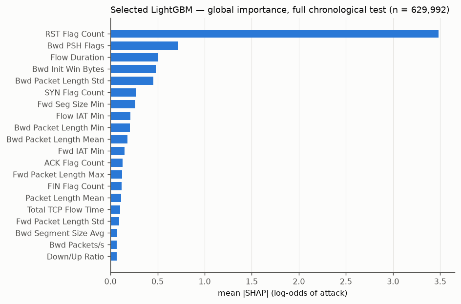
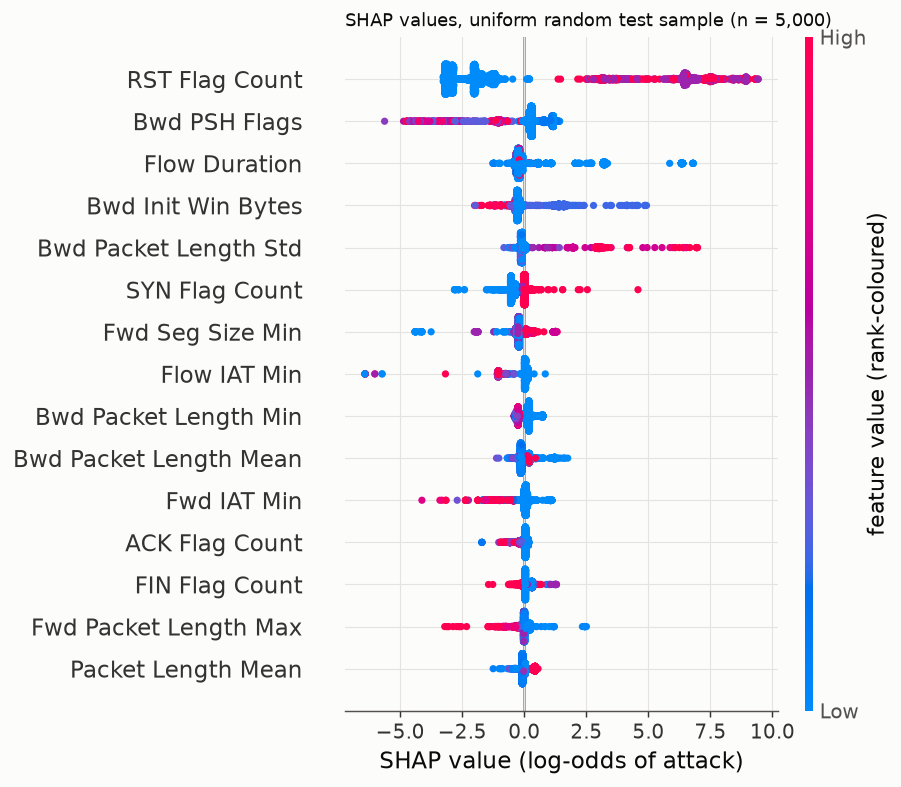
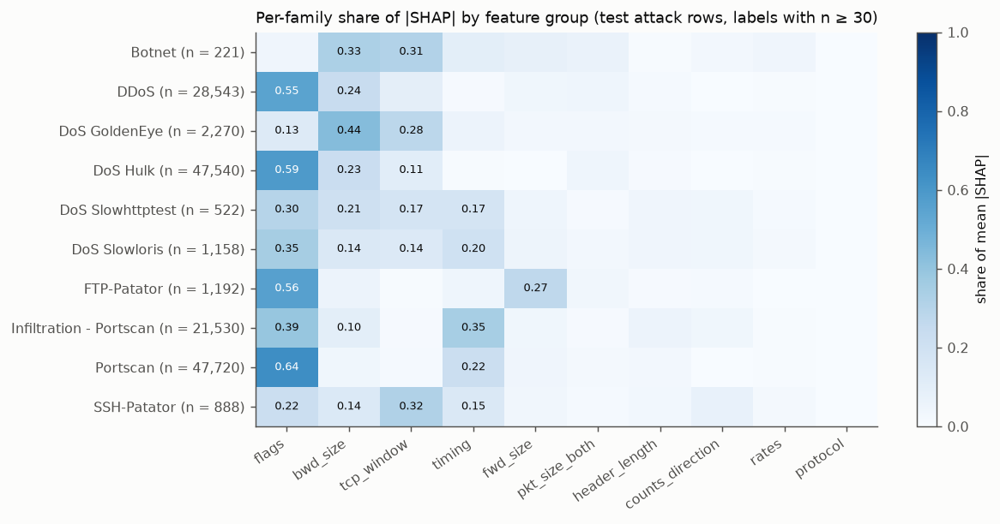
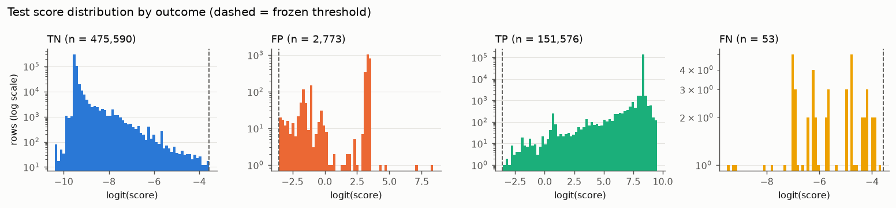
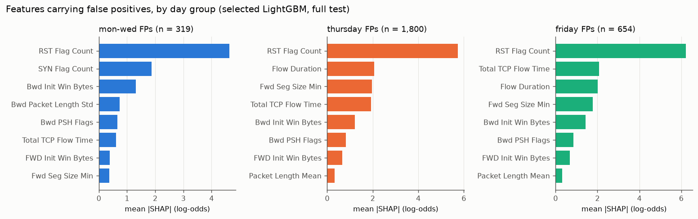
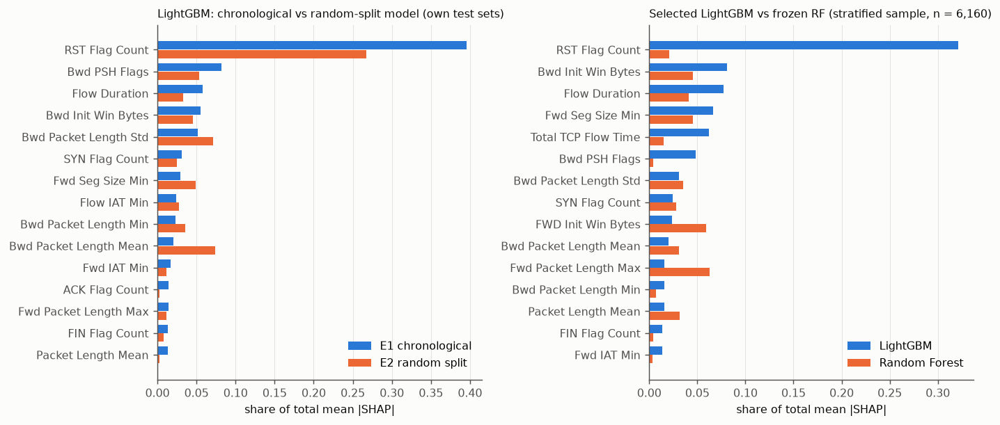
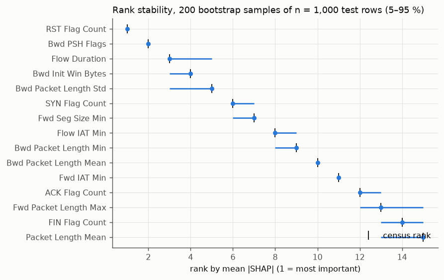
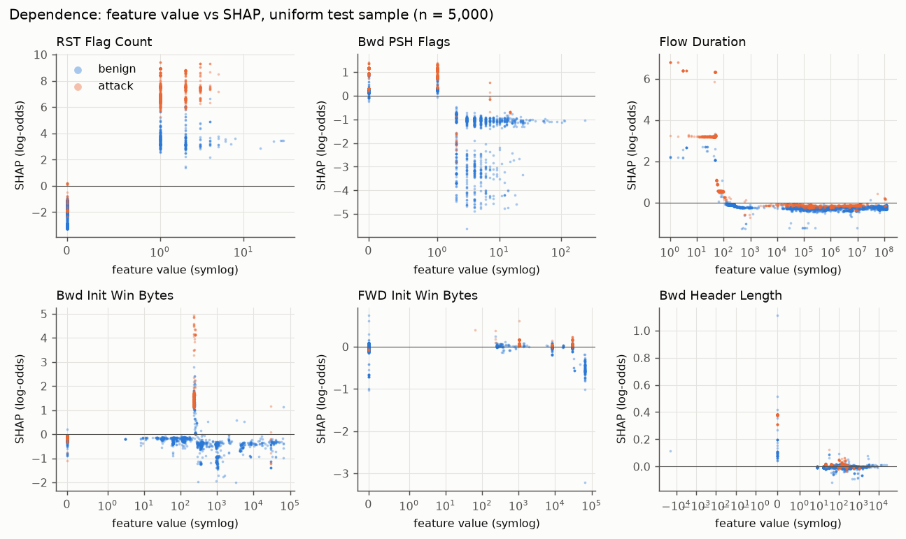
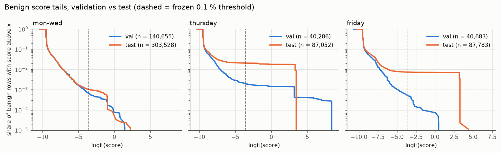

# Explainability Analysis — Milestone 5 (SHAP, false-positive and error analysis)

Generated by `scripts/render_m5.py` from `reports/generated/m5_*` (produced by `scripts/m5_explain.py` and `scripts/m5_analyze.py`). No number in this file is typed by hand. **Observed** marks what the artifacts show; **Interpretation** / **Hypothesis** marks explanations of it. SHAP values describe how the frozen model's output depends on its inputs; they are not causal effects in the network, and a feature with large SHAP values *contributes strongly to the model's predictions* — it does not cause attacks. Metadata (IPs, ports, times) is used only to describe rows; it is never a model input.

## 1. Objective

Explain the frozen protocol-v1 detector from Milestone 4 — what it relies on, why its false positives concentrate on Thursday and Friday, what its few misses look like, and how far the explanations can be trusted. Nothing was retrained, re-tuned, re-thresholded or relabelled; no SHAP result was used to change the model.

## 2. Frozen model and protocol

| Item | Value |
|---|---|
| Selected model | `artifacts/m4/models/E1_primary__lgbm__99966b1299.joblib` |
| Model SHA-256 | `e9a45e3dbb14a752674860cda17489cf8fe0d49f511748f8f8e5e96c154c3172` |
| Frozen threshold (0.1 % validation FPR target) | 0.027598 |
| Model inputs | 81 (82 manifest features; `Bwd URG Flags` removed as constant in train by the frozen preprocessor) |
| Preprocessor | embedded in each frozen Pipeline artifact (step 'pre'); covered by the model SHA-256 |
| `configs/m4_frozen.json` SHA-256 | `674908e196111411bc7572af2f727df8b678e089533ec54ebb329defa5670c4f` |
| `configs/experiment_protocol_v1.json` SHA-256 | `38ff66200023dacf89cb796f5ce088001cb3dd13cdc8bf8192185fd667455f8a` |
| Secondary models | E1 Random Forest (`artifacts/m4/models/E1_primary__rf__63b3d396c3.joblib`), E2 random-split LightGBM (`artifacts/m4/models/E2_random__lgbm__820fc7aaa4.joblib`) |
| Test outcomes at the frozen threshold | TP 151,576 · FP 2,773 · TN 475,590 · FN 53 (identical to Milestone 4) |

Every model file hash was checked before use; the attack scores recomputed from each frozen model equal the stored Milestone 4 predictions exactly (E1 test, E1 validation, E2 test: E1_lgbm_test_scores_equal_stored, E1_lgbm_val_scores_equal_stored, E2_lgbm_test_scores_equal_stored). Logistic regression was not explained with SHAP (not required; its coefficients act on log-scaled, standardised inputs and add little to the tree-model questions here).

## 3. SHAP methodology

- Library versions: shap 0.52.0, LightGBM 4.7.0, scikit-learn 1.9.1, Python 3.12.14.
- Method: path-dependent TreeSHAP (tree cover statistics from training; no background sample). For LightGBM the native `pred_contrib` implementation is used; on the uniform sample it equals `shap.TreeExplainer` with maximum absolute difference 0.
- **Output space (verified, not assumed): LightGBM SHAP values are in raw margin = log-odds of attack.** Base value -5.1157 (probability 0.0060); sigmoid(base + Σ SHAP) reproduces the stored attack probability on all 629,992 test rows with maximum absolute error 1.3e-14. The booster holds 162 trees and `best_iteration_` = 162 (frozen config: 162), so SHAP covers exactly the trees used for prediction.
- Random Forest SHAP values are in **probability of attack** (base 0.2402); additivity is checked against `predict_proba` on every explained row. LightGBM and RF values are therefore compared by rank and normalised share, never by raw magnitude.
- Feature order: SHAP columns are the frozen preprocessor's output names; the LightGBM booster's feature names are checked against them before every call (`src/ids/explain.py`).
- Repeatability: reloading the model from disk reproduces the SHAP matrix bitwise (True). SHAP interaction values sum back to the SHAP values within 8.5e-14.

## 4. Explanation sample design

Computing TreeSHAP for every test row was benchmarked as feasible (selected LightGBM: 168.9 s for 629,992 rows), so **LightGBM explanations are a census, not a sample**. Three populations are kept separate and labelled wherever used:

| Population | Rows | Rule | Used for |
|---|---|---|---|
| Census (test) | 629,992 | every chronological-test row; natural composition | global/per-family/FP/FN/novelty tables |
| Census (validation) | 290,609 | every validation row | validation→test shift (§17) |
| Uniform sample | 5,000 | uniform without replacement from key-sorted test rows, seed 20170703 | beeswarm, dependence plots, interaction values (first 1,000 rows), directionality |
| Stratified sample | 6,160 | all FP (2773) and FN (53); TN capped at 150 per (day, novel); TP capped at 150 per (label, novel); seeded, key-sorted | Random Forest SHAP, LightGBM-vs-RF comparison, casebook |

The stratified sample over-represents errors and rare labels by design; it is never used for a pooled "global importance" claim. Row IDs (`source_file`, `source_row`) of both samples are stored in `artifacts/m5/sample_*.parquet` and are re-derived identically by a clean rerun (§22).

## 5. Global feature importance (census, full chronological test)



| rank | feature | group | mean_abs_all | share_all | mean_abs_benign | mean_abs_attack | spearman_value_vs_shap_uniform | direction |
|---|---|---|---|---|---|---|---|---|
| 1 | RST Flag Count | flags | 3.482 | 0.395 | 2.472 | 6.666 | 0.782 | higher value -> toward attack |
| 2 | Bwd PSH Flags | flags | 0.720 | 0.082 | 0.629 | 1.008 | -0.372 | non-monotone / mixed |
| 3 | Flow Duration | timing | 0.510 | 0.058 | 0.252 | 1.325 | -0.540 | higher value -> toward benign |
| 4 | Bwd Init Win Bytes | tcp_window | 0.484 | 0.055 | 0.347 | 0.917 | 0.053 | non-monotone / mixed |
| 5 | Bwd Packet Length Std | bwd_size | 0.455 | 0.052 | 0.104 | 1.562 | 0.199 | non-monotone / mixed |
| 6 | SYN Flag Count | flags | 0.275 | 0.031 | 0.340 | 0.071 | 0.889 | higher value -> toward attack |
| 7 | Fwd Seg Size Min | header_length | 0.262 | 0.030 | 0.257 | 0.281 | 0.638 | higher value -> toward attack |
| 8 | Flow IAT Min | timing | 0.213 | 0.024 | 0.244 | 0.117 | -0.454 | non-monotone / mixed |
| 9 | Bwd Packet Length Min | bwd_size | 0.205 | 0.023 | 0.210 | 0.189 | -0.734 | higher value -> toward benign |
| 10 | Bwd Packet Length Mean | bwd_size | 0.183 | 0.021 | 0.155 | 0.273 | -0.287 | non-monotone / mixed |
| 11 | Fwd IAT Min | timing | 0.150 | 0.017 | 0.142 | 0.175 | -0.485 | non-monotone / mixed |
| 12 | ACK Flag Count | flags | 0.129 | 0.015 | 0.127 | 0.136 | -0.733 | higher value -> toward benign |
| 13 | Fwd Packet Length Max | fwd_size | 0.122 | 0.014 | 0.105 | 0.176 | -0.867 | higher value -> toward benign |
| 14 | FIN Flag Count | flags | 0.119 | 0.013 | 0.066 | 0.285 | -0.569 | higher value -> toward benign |
| 15 | Packet Length Mean | pkt_size_both | 0.116 | 0.013 | 0.082 | 0.222 | 0.239 | non-monotone / mixed |

**Observed:** `RST Flag Count` alone carries 39.5 % of total mean |SHAP| over the test set; the top five features (`RST Flag Count`, `Bwd PSH Flags`, `Flow Duration`, `Bwd Init Win Bytes`, `Bwd Packet Length Std`) carry 64.1 %. By feature group (census): flags 54.0 %, timing 13.8 %, backward (response) sizes 12.7 %, TCP window 7.2 %, header length 3.5 %, protocol 0.06 %. `Dst Port` is not an input of the frozen model. `direction` is the Spearman correlation between a feature's value and its SHAP value on the uniform sample (|ρ| ≥ 0.5 reported as monotone); most features are non-monotone.



**Interpretation:** the model's output is dominated by TCP flag counts and flow duration — properties of how a TCP exchange ends (reset vs orderly close) rather than payload content. This is consistent with the Milestone 2 finding that almost every attack is separable by one or two flow statistics in this testbed. It is a description of the model, not evidence that RST packets are malicious.

## 6. Per-family patterns (test attack rows, labels with n ≥ 30)



| label | n | feature (share, mean signed SHAP) |
|---|---|---|
| Botnet | 221 | Bwd Init Win Bytes (0.26, +3.92) · Subflow Bwd Bytes (0.09, +1.34) · Bwd Packet Length Mean (0.07, +1.04) · RST Flag Count (0.06, -0.94) · Bwd Segment Size Avg (0.04, +0.58) |
| DDoS | 28543 | RST Flag Count (0.45, +7.00) · Bwd Packet Length Std (0.19, +2.99) · Bwd Init Win Bytes (0.09, +1.36) · Bwd PSH Flags (0.05, +0.66) · Packet Length Mean (0.03, +0.41) |
| DoS GoldenEye | 2270 | Bwd Packet Length Std (0.30, +5.44) · Bwd Init Win Bytes (0.21, +3.50) · RST Flag Count (0.14, -0.03) · FIN Flag Count (0.06, +1.02) · Bwd Packet Length Min (0.03, +0.53) |
| DoS Hulk | 47540 | RST Flag Count (0.45, +7.00) · Bwd Packet Length Std (0.18, +2.85) · Bwd Init Win Bytes (0.10, +1.49) · Bwd PSH Flags (0.07, +1.06) · Packet Length Mean (0.03, +0.40) |
| DoS Slowhttptest | 522 | RST Flag Count (0.21, +2.34) · Bwd Init Win Bytes (0.13, +1.91) · Bwd Packet Length Mean (0.06, +0.76) · Bwd IAT Max (0.05, +0.80) · Total Length of Bwd Packet (0.04, +0.63) |
| DoS Slowloris | 1158 | RST Flag Count (0.25, +3.48) · Bwd Init Win Bytes (0.10, +1.38) · Bwd PSH Flags (0.05, +0.81) · Bwd Packet Length Mean (0.04, +0.60) · Flow Duration (0.04, +0.67) |
| FTP-Patator | 1192 | RST Flag Count (0.41, +6.99) · Fwd Packet Length Max (0.14, +2.40) · Fwd Packet Length Std (0.08, +1.43) · Bwd RST Flags (0.07, +1.21) · Bwd Packet Length Mean (0.04, +0.76) |
| Infiltration - Portscan | 21530 | RST Flag Count (0.32, +3.50) · Flow Duration (0.23, +3.67) · Bwd Packet Length Mean (0.05, +0.72) · Bwd PSH Flags (0.05, +0.70) · Fwd Seg Size Min (0.04, +0.62) |
| Portscan | 47720 | RST Flag Count (0.50, +7.29) · Flow Duration (0.16, +2.26) · Bwd PSH Flags (0.08, +1.17) · FIN Flag Count (0.02, +0.30) · Fwd Seg Size Min (0.02, +0.29) |
| SSH-Patator | 888 | Bwd Init Win Bytes (0.25, +4.04) · Fwd PSH Flags (0.22, +3.59) · Bwd Packet Length Mean (0.07, +1.08) · Total Fwd Packet (0.06, +1.00) · Bwd IAT Total (0.05, +0.75) |

**Observed:** `RST Flag Count` is the top feature for 7 of 10 families; the exceptions are Botnet (`Bwd Init Win Bytes`), DoS GoldenEye (`Bwd Packet Length Std`), SSH-Patator (`Bwd Init Win Bytes`). Pairwise top-10 overlap between families ranges 0.2–0.8 (median 0.5; `m5_family_top10_overlap.csv`); the least similar family on average is FTP-Patator (mean overlap 0.31). Full per-family tables: `m5_family_top_features.csv` (mean |SHAP|, mean signed SHAP, SD, median value).

**Interpretation:** families share a common core (flags, response size, backward window) with family-specific secondary features. Several of these — the victim's initial TCP window (`Bwd Init Win Bytes`), response-size statistics — describe the *victim server's* reply in this lab rather than attacker behaviour; this supports the Milestone 2 concern that detection partly rests on victim/tool signatures. SHAP cannot show whether the model "understands" an attack.

## 7. True-positive explanations

**Observed:** true positives (n = 151,576) have median score 0.9998 and 1 % quantile 0.9933 (`m5_score_quantiles.csv`); their mean total |SHAP| is 8.81 log-odds over all rows and much larger for attacks than for benign rows (`m5_global_importance.csv`, `mean_abs_attack` vs `mean_abs_benign`). The large DoS/DDoS and scan families are carried by `RST Flag Count` together with `Bwd Packet Length Std` (DoS/DDoS) or `Flow Duration` (scans); see §6. Representative local explanations are in the casebook (§19).

## 8. False-positive analysis

Test false positives at the frozen threshold: **2,773** ("false positives under the benchmark labels"). They fall in 105 ordered (day, source, destination) host pairs; the 15 largest pairs hold 95.5 % of them.

| partition | day | benign | fp | fpr (95 % CI) | fp_reverse | fp_attempted | benign_reverse_share |
|---|---|---|---|---|---|---|---|
| val | friday | 40683 | 21 | 0.052 % (95 % CI 0.034–0.079 %) | 0 | 6 | 0.00002 |
| val | monday | 51627 | 8 | 0.015 % (95 % CI 0.008–0.031 %) | 0 | 0 | 0.00000 |
| val | thursday | 40286 | 78 | 0.194 % (95 % CI 0.155–0.242 %) | 41 | 5 | 0.00102 |
| val | tuesday | 43736 | 45 | 0.103 % (95 % CI 0.077–0.138 %) | 0 | 0 | 0.00000 |
| val | wednesday | 45292 | 40 | 0.088 % (95 % CI 0.065–0.120 %) | 0 | 30 | 0.01822 |
| test | friday | 87783 | 654 | 0.745 % (95 % CI 0.690–0.804 %) | 629 | 3 | 0.01346 |
| test | monday | 111486 | 22 | 0.020 % (95 % CI 0.013–0.030 %) | 0 | 0 | 0.00000 |
| test | thursday | 87052 | 1800 | 2.068 % (95 % CI 1.975–2.164 %) | 1766 | 10 | 0.02057 |
| test | tuesday | 94544 | 50 | 0.053 % (95 % CI 0.040–0.070 %) | 0 | 1 | 0.00000 |
| test | wednesday | 97498 | 247 | 0.253 % (95 % CI 0.224–0.287 %) | 0 | 212 | 0.00136 |

`fp_reverse` = FPs whose (destination, source) is a successful-attack (source, destination) pair on the same day; `benign_reverse_share` = share of all benign rows of that day/partition with that property.

Largest false-positive host pairs:

| day | Src IP | Dst IP | fp | benign_test_rows | fpr_within_pair | reverse_of_attack | reverse_attack_labels | train_benign_rows | val_benign_rows | val_fp | top_dst_ports |
|---|---|---|---|---|---|---|---|---|---|---|---|
| friday | 192.168.10.50 | 172.16.0.1 | 629 | 1182 | 0.532 | True | DDoS, Portscan | 0 | 1 | 0 | 51903:21, 36114:11, 42668:10 |
| thursday | 192.168.10.25 | 192.168.10.8 | 431 | 431 | 1.000 | True | Infiltration - Portscan | 0 | 0 | 0 | 54031:97, 49846:96, 35515:68 |
| thursday | 192.168.10.51 | 192.168.10.8 | 266 | 266 | 1.000 | True | Infiltration - Portscan | 0 | 0 | 0 | 51296:107, 43216:68, 63036:39 |
| thursday | 192.168.10.12 | 192.168.10.8 | 265 | 269 | 0.985 | True | Infiltration - Portscan | 0 | 0 | 0 | 61350:73, 64399:67, 42452:63 |
| thursday | 192.168.10.16 | 192.168.10.8 | 234 | 238 | 0.983 | True | Infiltration - Portscan | 0 | 0 | 0 | 45748:65, 34036:61, 38739:57 |
| thursday | 192.168.10.19 | 192.168.10.8 | 215 | 219 | 0.982 | True | Infiltration - Portscan | 0 | 0 | 0 | 61232:65, 61049:56, 50746:50 |
| wednesday | 172.16.0.1 | 192.168.10.50 | 212 | 1762 | 0.120 | False | nan | 2717 | 700 | 30 | 80:212 |
| thursday | 192.168.10.17 | 192.168.10.8 | 193 | 197 | 0.980 | True | Infiltration - Portscan | 0 | 0 | 0 | 51014:64, 65226:64, 54435:59 |
| thursday | 192.168.10.9 | 192.168.10.8 | 156 | 161 | 0.969 | True | Infiltration - Portscan | 0 | 0 | 0 | 39692:56, 45500:30, 63448:24 |
| wednesday | 192.168.10.17 | 111.93.223.135 | 10 | 10 | 1.000 | False | nan | 0 | 0 | 0 | 443:10 |
| thursday | 172.16.0.1 | 192.168.10.50 | 9 | 617 | 0.015 | False | nan | 1118 | 284 | 17 | 21:8, 80:1 |
| thursday | 192.168.10.25 | 205.174.165.73 | 9 | 14 | 0.643 | False | nan | 6 | 6 | 5 | 444:9 |
| thursday | 192.168.10.50 | 192.168.10.8 | 6 | 10 | 0.600 | True | Infiltration - Portscan | 0 | 0 | 0 | 0:4, 3210:1, 51700:1 |
| tuesday | 192.168.10.8 | 192.168.10.50 | 6 | 64 | 0.094 | False | nan | 105 | 33 | 1 | 22:6 |
| wednesday | 192.168.10.9 | 117.27.232.35 | 6 | 33 | 0.182 | False | nan | 0 | 0 | 0 | 80:6 |

**Observed:**
- 2,395 of 2,773 FPs (86.4 %) are reverse-direction traffic of a same-day attack pair; reverse-direction benign rows make up 0.65 % of test benign rows but have an FPR of 77.1 % (95 % CI 75.6–78.6 %).
- Thursday: FPs run from the internal hosts scanned by `192.168.10.8` (the Infiltration - Portscan source) back to it; the scanned hosts' ports appear as source ports and ephemeral high ports as destination ports. Friday: `192.168.10.50 → 172.16.0.1`, the reverse of the Friday DDoS and Portscan pair.
- The reverse-direction pairs in this table have 0 benign rows in train and at most 1 in validation (`train_benign_rows`, `val_benign_rows`).
- Wednesday's FPs are different: `172.16.0.1 → 192.168.10.50` on port 80 in the *attack* direction, 212 of them labelled `- Attempted` (the Milestone 4 per-label table attributes flagged Attempted rows mainly to `DoS Slowhttptest - Attempted`), benign under the protocol-v1 target.
- FPs collapse onto few model inputs: Thursday 1,800 FPs have 373 distinct feature vectors and 52 distinct scores; Friday 654 FPs, 113 vectors, 26 scores (`m5_fp_profile.csv`).
- FPs have 3.0× (Thursday) and 3.0× (Friday) the median total |SHAP| of same-day true negatives (median Σ|SHAP| Thursday 18.4 vs 6.2 for Thursday TNs): they are confident predictions, not borderline ones (median FP score Thursday 0.964, Friday 0.961; threshold 0.0276).
- 2,752 of 2,773 FPs are novel vectors (no exact match in train). Of the Thursday FP vectors, 20 occur in train with a benign label only and none with an attack label.



## 9. Thursday vs Friday vs Monday–Wednesday

| quantity | mon-wed | thursday | friday |
|---|---|---|---|
| benign_test | 303528 | 87052 | 87783 |
| fp | 319 | 1800 | 654 |
| fpr | 0.001051 | 0.020677 | 0.0074502 |
| ci95_low | 0.00094185 | 0.019753 | 0.0069025 |
| ci95_high | 0.0011727 | 0.021644 | 0.008041 |
| fp_share_reverse | 0 | 0.98111 | 0.96177 |
| fp_share_attempted | 0.66771 | 0.0055556 | 0.0045872 |
| fp_share_in_attack_window | 0.37931 | 0.99167 | 0.98471 |
| tn_share_in_attack_window | 0.24245 | 0.45814 | 0.539 |
| benign_score_q0.99 | 0.00080684 | 0.96447 | 0.0021968 |
| benign_score_q0.999 | 0.03344 | 0.96931 | 0.96356 |
| fp_score_median | 0.2541 | 0.96447 | 0.96069 |
| fp_median_sum_abs_shap | 16.023 | 18.369 | 18.243 |
| tn_median_sum_abs_shap | 6.1687 | 6.1548 | 6.1665 |
| fp_top5_features | RST Flag Count, SYN Flag Count, Bwd Init Win Bytes, Bwd Packet Length Std, Bwd PSH Flags | RST Flag Count, Flow Duration, Fwd Seg Size Min, Total TCP Flow Time, Bwd Init Win Bytes | RST Flag Count, Total TCP Flow Time, Flow Duration, Fwd Seg Size Min, Bwd Init Win Bytes |
| fp_protocols | 6:305, 17:9, 0:4 | 6:1736, 1:55, 17:9 | 6:650, 17:2, 1:2 |
| fp_top_dst_ports | 80:235, 443:37, 22:27, 53:6, 0:5 | 51296:107, 54031:97, 49846:96, 61350:73, 35515:68 | 51903:21, 36114:11, 80:10, 42668:10, 58056:9 |
| fp_top_src_ports | 0:5, 137:3, 49685:3, 38168:2, 58513:1 | 0:55, 8888:7, 21:7, 1600:6, 143:6 | 1051:4, 4126:4, 8021:4, 1036:3, 18988:3 |
| fp_n_host_pairs | 59 | 20 | 20 |
| fp_top3_pairs_share | 0.71787 | 0.53444 | 0.97095 |
| fp_top_pairs | 172.16.0.1 -> 192.168.10.50 (213); 192.168.10.17 -> 111.93.223.135 (10); 192.168.10.8 -> 192.168.10.50 (6) | 192.168.10.25 -> 192.168.10.8 (431); 192.168.10.51 -> 192.168.10.8 (266); 192.168.10.12 -> 192.168.10.8 (265) | 192.168.10.50 -> 172.16.0.1 (629); 192.168.10.25 -> 192.168.10.50 (4); 192.168.10.17 -> 104.197.43.56 (2) |

`in_attack_window` = flow start inside [first start, last end] of a same-day successful-attack label; protocol codes: 6 = TCP, 17 = UDP, 1 = ICMP, 0 = the flagged Protocol-0 rows.



| daygroup | rank | feature | fp_mean_abs | fp_mean_signed | tn_mean_signed | fp_median_value | tn_median_value |
|---|---|---|---|---|---|---|---|
| mon-wed | 1 | RST Flag Count | 4.631 | 4.231 | -1.783 | 1.000 | 0.000 |
| mon-wed | 2 | SYN Flag Count | 1.880 | -1.761 | -0.321 | 0.000 | 0.000 |
| mon-wed | 3 | Bwd Init Win Bytes | 1.319 | 1.114 | -0.284 | 235.000 | 0.000 |
| mon-wed | 4 | Bwd Packet Length Std | 0.737 | 0.517 | -0.094 | 1298.110 | 0.000 |
| mon-wed | 5 | Bwd PSH Flags | 0.662 | 0.510 | -0.274 | 1.000 | 0.000 |
| mon-wed | 6 | Total TCP Flow Time | 0.607 | -0.590 | -0.026 | 409703000.000 | 0.000 |
| mon-wed | 7 | FWD Init Win Bytes | 0.396 | -0.379 | -0.037 | 0.000 | 0.000 |
| mon-wed | 8 | Fwd Seg Size Min | 0.370 | -0.339 | -0.221 | 0.000 | 8.000 |
| mon-wed | 9 | Bwd Packet Length Mean | 0.366 | -0.240 | -0.128 | 991.500 | 116.000 |
| mon-wed | 10 | FIN Flag Count | 0.343 | 0.281 | -0.005 | 1.000 | 0.000 |
| thursday | 1 | RST Flag Count | 5.729 | 5.577 | -1.931 | 2.000 | 0.000 |
| thursday | 2 | Flow Duration | 2.058 | 2.048 | -0.216 | 48.000 | 61890.000 |
| thursday | 3 | Fwd Seg Size Min | 1.964 | -1.947 | -0.212 | 20.000 | 8.000 |
| thursday | 4 | Total TCP Flow Time | 1.929 | 1.925 | -0.018 | 48.000 | 0.000 |
| thursday | 5 | Bwd Init Win Bytes | 1.217 | -1.177 | -0.279 | 1024.000 | 0.000 |
| thursday | 6 | Bwd PSH Flags | 0.811 | 0.801 | -0.189 | 0.000 | 0.000 |
| thursday | 7 | FWD Init Win Bytes | 0.672 | -0.671 | -0.036 | 0.000 | 0.000 |
| thursday | 8 | Packet Length Mean | 0.331 | -0.330 | -0.073 | 0.000 | 80.500 |
| thursday | 9 | SYN Flag Count | 0.320 | -0.146 | -0.323 | 2.000 | 0.000 |
| thursday | 10 | Fwd IAT Min | 0.282 | 0.277 | -0.042 | 48.000 | 3.000 |
| friday | 1 | RST Flag Count | 6.229 | 6.143 | -1.806 | 1.000 | 0.000 |
| friday | 2 | Total TCP Flow Time | 2.071 | 2.066 | -0.016 | 2.000 | 0.000 |
| friday | 3 | Flow Duration | 2.015 | 1.983 | -0.213 | 2.000 | 60273.000 |
| friday | 4 | Fwd Seg Size Min | 1.772 | -1.761 | -0.231 | 20.000 | 8.000 |
| friday | 5 | Bwd Init Win Bytes | 1.431 | -1.302 | -0.293 | 1024.000 | 0.000 |
| friday | 6 | Bwd PSH Flags | 0.859 | 0.825 | -0.217 | 0.000 | 0.000 |
| friday | 7 | FWD Init Win Bytes | 0.689 | -0.688 | -0.032 | 0.000 | 0.000 |
| friday | 8 | Packet Length Mean | 0.318 | -0.316 | -0.072 | 0.000 | 78.000 |
| friday | 9 | Bwd Packet Length Std | 0.213 | -0.172 | -0.095 | 0.000 | 0.000 |
| friday | 10 | Fwd Packet Length Max | 0.206 | 0.198 | -0.091 | 0.000 | 46.000 |

**Observed:**
- Thursday (2.07 % (95 % CI 1.98–2.16 %)) and Friday (0.75 % (95 % CI 0.69–0.80 %)) FPs are carried by the **same features**: `RST Flag Count` (FP median value 2 on Thursday, 1 on Friday; TN median 0), very short `Flow Duration` (FP median 48 µs Thursday, 2 µs Friday; TN median 61890 µs), with `Fwd Seg Size Min` (FP median 20) and `Bwd Init Win Bytes` (FP median 1024) pulling *toward benign* (negative mean signed SHAP). Their group-share profiles are nearly identical (flags 40 % / 43 %, timing 28 % / 27 %).
- They differ in **host pairs and scenario**: Thursday FPs come from 20 pairs, mostly scanned internal hosts replying to `192.168.10.8`; Friday FPs are 97 % one pair (`192.168.10.50 → 172.16.0.1`).
- Thursday reverse rows are flagged almost always (98.6 % (95 % CI 97.9–99.1 %)), Friday reverse rows about half the time (53.2 % (95 % CI 50.4–56.0 %)).
- The mean SHAP vector of Thursday FPs is closest to that of Portscan attack rows (Portscan (0.89); Infiltration - Portscan (0.76); FTP-Patator (0.75)); Friday FPs likewise (Portscan (0.90); FTP-Patator (0.77); Infiltration - Portscan (0.75)). Monday–Wednesday FPs resemble the DoS profile (DoS Hulk (0.88); DDoS (0.87); DoS Slowloris (0.85)).
- Monday–Wednesday FPs (0.105 % (95 % CI 0.094–0.117 %)) are 67 % `- Attempted` rows and none are reverse-direction.

**Interpretation:** the Thursday/Friday false positives are one phenomenon seen through two scenarios: short, reset-terminated flows in the reply direction of a scan (Thursday internal scan; Friday external scan/DDoS), which the model scores the way it scores scan flows. The day difference is driven by *which host pairs and scenario* are present, not by different features.

**Hypothesis (not established):** these rows are parts of scan exchanges that the flow meter recorded as separate flows initiated by the victim (e.g. RST/ACK replies that outlived or preceded the original flow record). The improved dataset's labelling matches the attacker as *source*, so such rows keep `BENIGN` — a possible labelling asymmetry or scenario artefact. This is not claimed as mislabelling; no row was relabelled (protocol v1).

## 10. False-negative cases (all of them)

| label | n | label_test_n | min_margin | max_margin | novel | exact_in_train | median_outside | tp_median_outside | train_rows |
|---|---|---|---|---|---|---|---|---|---|
| DoS Slowhttptest | 1 | 522 | -2.68 | -2.68 | 1 | 0 | 20.00 | 3 | 704 |
| DoS Slowloris | 1 | 1158 | -4.26 | -4.26 | 1 | 0 | 14.00 | 1 | 1871 |
| Heartbleed | 1 | 3 | -0.73 | -0.73 | 1 | 0 | 31.00 | 13 | 6 |
| Infiltration | 10 | 11 | -2.17 | -0.09 | 10 | 0 | 6.00 | 14 | 20 |
| Infiltration - Portscan | 1 | 21530 | -0.62 | -0.62 | 1 | 0 | 22.00 | 0 | 40188 |
| Portscan | 14 | 47720 | -5.95 | -0.47 | 14 | 0 | 27.00 | 0 | 89075 |
| SSH-Patator | 25 | 888 | -5.75 | -0.58 | 25 | 0 | 35.00 | 0 | 1651 |

`logit_margin` = logit(score) − logit(threshold) (negative = below threshold). `median_outside` = features of the FN outside its label's train [0.5 %, 99.5 %] range, compared with the same count for that label's test TPs. Case table (all 53 rows, top three contributions toward benign and toward attack): `reports/generated/m5_fn_cases.csv`. Excerpt:

| id | label | score | logit_margin | novel | top_toward_benign | top_toward_attack |
|---|---|---|---|---|---|---|
| thursday:76465 | Infiltration | 0.0254 | -0.0864 | True | RST Flag Count=0 (-1.60); SYN Flag Count=0 (-0.77); Fwd Seg Size Min=20 (-0.28) | Bwd Packet Length Mean=0 (+1.21); Fwd Packet Length Mean=396.824 (+0.70); Fwd PSH Flags=34 (+0.56) |
| friday:223687 | Portscan | 0.0174 | -0.4701 | True | RST Flag Count=0 (-1.85); FIN Flag Count=2 (-0.40); Flow Duration=3.57595e+06 (-0.36) | Bwd Init Win Bytes=227 (+1.51); Bwd Packet Length Mean=0 (+0.66); Bwd Packet Length Min=0 (+0.58) |
| tuesday:79299 | SSH-Patator | 0.0156 | -0.5845 | True | Bwd PSH Flags=7 (-1.03); RST Flag Count=0 (-0.56); Bwd IAT Total=4.71719e+06 (-0.42) | Bwd Init Win Bytes=247 (+2.93); FIN Flag Count=0 (+0.45); Bwd Packet Length Min=0 (+0.42) |
| thursday:354835 | Infiltration - Portscan | 0.0151 | -0.6169 | True | RST Flag Count=0 (-2.58); SYN Flag Count=0 (-0.54); Bwd Init Win Bytes=0 (-0.24) | Total Length of Bwd Packet=386 (+1.14); Packet Length Min=50 (+1.05); Total Length of Fwd Packet=100 (+0.73) |
| wednesday:345655 | Heartbleed | 0.0135 | -0.7295 | True | Bwd PSH Flags=34 (-1.97); Bwd Init Win Bytes=349 (-1.10); ACK Flag Count=1031 (-0.75) | Bwd Packet Length Std=2365.63 (+3.74); RST Flag Count=1 (+2.43); Fwd PSH Flags=25 (+0.49) |
| wednesday:33926 | DoS Slowhttptest | 0.0019 | -2.6833 | True | RST Flag Count=0 (-1.62); Bwd PSH Flags=6 (-1.04); FIN Flag Count=2 (-0.35) | Bwd Packet Length Std=1532.26 (+0.76); Bwd Packet Length Min=0 (+0.63); Active Min=775 (+0.43) |
| wednesday:31256 | DoS Slowloris | 0.0004 | -4.2553 | True | Fwd IAT Min=336 (-1.74); FIN Flag Count=3 (-1.46); Bwd Packet Length Mean=161 (-1.07) | RST Flag Count=1 (+5.27); Bwd Init Win Bytes=235 (+1.19); Bwd PSH Flags=1 (+1.03) |

**Observed:** all 53 FNs are novel vectors and none has an exact match in train (benign or attack). `RST Flag Count = 0` is among the top contributions toward benign in 50 of 53 cases — the misses are attack flows that *lack* the reset signature the model leans on. SSH-Patator misses sit far outside that label's typical training range (median 35 features outside vs 0 for its TPs). Margins range from -5.95 to -0.09 log-odds; 12 are within 1 log-odds unit of the threshold.

**Caution:** Infiltration (10 FNs of 11 test rows, 20 training rows) and Heartbleed (1 of 3) have too few rows for general statements; their `outside` counts use tiny reference sets. These are case descriptions only.

## 11. Novel-vector explanations

| population | n | attack_share | fp | mean_sum_abs_shap | top10 | top10_overlap_with_full | spearman_with_full |
|---|---|---|---|---|---|---|---|
| full_test | 629992 | 0.241 | 2773 | 8.809 | RST Flag Count, Bwd PSH Flags, Flow Duration, Bwd Init Win Bytes, Bwd Packet Length Std, SYN Flag Count, Fwd Seg Size Min, Flow IAT Min, Bwd Packet Length Min, Bwd Packet Length Mean | 1.000 | 1.000 |
| novel_test | 511247 | 0.165 | 2752 | 8.194 | RST Flag Count, Bwd PSH Flags, Bwd Packet Length Std, Bwd Init Win Bytes, SYN Flag Count, Flow Duration, Fwd Seg Size Min, Flow IAT Min, Bwd Packet Length Min, Bwd Packet Length Mean | 1.000 | 0.995 |
| duplicated_test | 118745 | 0.566 | 21 | 11.456 | RST Flag Count, Flow Duration, Bwd PSH Flags, Fwd Seg Size Min, SYN Flag Count, Bwd Packet Length Min, Bwd Packet Length Mean, Bwd Init Win Bytes, FIN Flag Count, Flow IAT Min | 0.900 | 0.965 |

**Observed:** on the novel subset the global ranking is almost unchanged (Spearman 0.995, top-10 overlap 1.0); 2,752 of 2,773 FPs are novel and their explanation profile equals that of all FPs (top-10 overlap 1.0). The novel subset has a lower attack share (scans are mostly duplicated), so pooled magnitudes shift with composition.

**Interpretation:** explanations do not change materially when exact-duplicate vectors are removed; the false-positive mechanism is entirely a novel-vector phenomenon.

## 12. Duplicate vs novel vectors (within label)

| label | n_novel | n_dup | mean_logit_novel | mean_logit_dup | median_logit_novel | median_logit_dup | mean_sum_abs_shap_novel | mean_sum_abs_shap_dup | flag_rate_novel | flag_rate_dup | top5_overlap | spearman |
|---|---|---|---|---|---|---|---|---|---|---|---|---|
| BENIGN | 424115 | 50653 | -9.297 | -9.449 | -9.511 | -9.511 | 6.702 | 6.750 | 0.006 | 0.000 | 0.600 | 0.947 |
| Botnet - Attempted | 321 | 899 | -9.224 | -8.517 | -9.399 | -8.022 | 11.748 | 15.472 | 0.009 | 0.000 | 0.800 | 0.941 |
| Infiltration - Portscan | 1538 | 19992 | 7.183 | 8.392 | 8.384 | 8.388 | 14.514 | 15.886 | 0.999 | 1.000 | 0.600 | 0.952 |
| Portscan | 520 | 47200 | 4.813 | 8.384 | 6.342 | 8.386 | 14.786 | 14.554 | 0.973 | 1.000 | 0.400 | 0.925 |

**Observed:** comparisons are made within label (only labels with ≥ 30 novel and ≥ 30 duplicated rows) to control for family mix. For the scan labels, novel rows receive lower scores than duplicated ones (mean logit 4.81 vs 8.38 for Portscan) with partly different top features (top-5 overlap 0.4). For BENIGN rows the score and |SHAP| levels are nearly equal. **Interpretation:** duplicated scan rows are the most templated vectors and sit deepest in the attack region; this is an association, not a causal effect of duplication.

## 13. Random-split explanation comparison (E2, frozen)

| population | top10_overlap | spearman | E1_top5 | E2_top5 | E1_mean_sum_abs | E2_mean_sum_abs |
|---|---|---|---|---|---|---|
| all_test | 0.900 | 0.857 | RST Flag Count, Bwd PSH Flags, Flow Duration, Bwd Init Win Bytes, Bwd Packet Length Std | RST Flag Count, Bwd Packet Length Mean, Bwd Packet Length Std, Bwd PSH Flags, Fwd Seg Size Min | 8.809 | 13.268 |
| benign | 0.800 | 0.851 | RST Flag Count, Bwd PSH Flags, Bwd Init Win Bytes, SYN Flag Count, Fwd Seg Size Min | RST Flag Count, Bwd Packet Length Mean, Bwd PSH Flags, Fwd Seg Size Min, Bwd Init Win Bytes | 6.744 | 10.272 |
| attack | 0.800 | 0.842 | RST Flag Count, Bwd Packet Length Std, Flow Duration, Bwd PSH Flags, Bwd Init Win Bytes | RST Flag Count, Bwd Packet Length Std, Bwd Packet Length Mean, Flow Duration, Bwd Init Win Bytes | 15.321 | 22.718 |
| FP | 0.600 | 0.865 | RST Flag Count, Flow Duration, Total TCP Flow Time, Fwd Seg Size Min, Bwd Init Win Bytes | RST Flag Count, Fwd Seg Size Min, Bwd Init Win Bytes, Bwd Packet Length Std, Bwd Packet Length Mean | 17.796 | 18.018 |

**Observed:** the E2 model (same hyper-parameters, trained on the random split) ranks features similarly (all-test Spearman 0.86, top-10 overlap 0.9) but with larger magnitudes (mean Σ|SHAP| 13.3 vs 8.8). Its 121 test FPs are 16 % reverse-direction; on its own test set, reverse-direction benign rows have FPR 1.18 % (E1: 77.1 %) and other benign rows 0.021 %. Each model is explained on its own test partition (the partitions differ), so this is not a paired comparison.

**Interpretation:** the evidence does *not* show that the random split makes the model rely on different, more scenario-specific features. What differs observably is how the two models score reply-direction rows; a plausible reason is exposure — under the random split such rows from the attack windows are also in training. This is consistent with the §17 account of the chronological FPR gap.

## 14. LightGBM vs Random Forest



| population | n | top10_overlap | spearman | lgbm_top5 | rf_top5 | median_row_cosine |
|---|---|---|---|---|---|---|
| all_sample | 6160 | 0.500 | 0.652 | RST Flag Count, Bwd Init Win Bytes, Flow Duration, Fwd Seg Size Min, Total TCP Flow Time | Fwd Packet Length Max, FWD Init Win Bytes, Fwd Seg Size Min, Bwd Init Win Bytes, Flow Duration | 0.383 |
| TN | 1500 | 0.300 | 0.597 | RST Flag Count, Bwd PSH Flags, SYN Flag Count, Fwd Seg Size Min, Bwd Init Win Bytes | SYN Flag Count, Bwd Packet Length Std, Bwd Segment Size Avg, Packet Length Mean, Bwd Packet Length Mean | 0.322 |
| FP | 2773 | 0.400 | 0.636 | RST Flag Count, Flow Duration, Total TCP Flow Time, Fwd Seg Size Min, Bwd Init Win Bytes | FWD Init Win Bytes, Fwd Packet Length Max, Fwd Seg Size Min, Bwd Init Win Bytes, Flow Duration | 0.401 |
| TP | 1834 | 0.300 | 0.582 | RST Flag Count, Bwd Init Win Bytes, Bwd Packet Length Std, Flow Duration, Bwd PSH Flags | Bwd Packet Length Std, Fwd Packet Length Max, Bwd Packet Length Mean, Packet Length Std, Bwd Segment Size Avg | 0.357 |
| FN | 53 | 0.300 | 0.585 | RST Flag Count, Bwd Init Win Bytes, Bwd PSH Flags, Bwd Packet Length Mean, Fwd IAT Min | Bwd Segment Size Avg, Bwd Packet Length Mean, Fwd Packet Length Max, Bwd Packet Length Std, Flow IAT Max | 0.218 |

Feature-group shares (stratified sample):

| group | lgbm_share | rf_share |
|---|---|---|
| flags | 0.427 | 0.074 |
| timing | 0.208 | 0.155 |
| tcp_window | 0.119 | 0.112 |
| bwd_size | 0.078 | 0.151 |
| header_length | 0.077 | 0.068 |
| fwd_size | 0.047 | 0.179 |
| pkt_size_both | 0.021 | 0.144 |
| counts_direction | 0.011 | 0.026 |
| rates | 0.011 | 0.087 |
| protocol | 0.002 | 0.003 |

**Observed:** the two tree models agree only moderately (top-10 overlap 0.5, Spearman 0.65, median per-row cosine similarity 0.38). LightGBM concentrates attribution on flags (43 %); the forest spreads it over packet-size features (47 % for forward, both-direction and backward sizes) and gives flags 7 %. They agree on TCP window (12 % vs 11 %) and header length. They also make largely the same errors: 2,598 test rows are FPs of both models (LightGBM 2,773, RF 3,119).

**Interpretation:** which feature *gets the credit* depends on the model family (many features are strongly correlated, and a random forest with `max_features = sqrt` spreads credit across correlated alternatives). Feature-level SHAP rankings of the selected model should therefore not be read as properties of the data. The shared false positives indicate that both models find the reverse-direction rows attack-like. Agreement is not evidence of correctness.

## 15. Explanation stability



| bootstrap_n | feature | census_rank | rank_p5 | rank_median | rank_p95 | top10_freq |
|---|---|---|---|---|---|---|
| 1000 | RST Flag Count | 1 | 1 | 1 | 1.00 | 1 |
| 1000 | Bwd PSH Flags | 2 | 2 | 2 | 2.00 | 1 |
| 1000 | Flow Duration | 3 | 3 | 3 | 5.00 | 1 |
| 1000 | Bwd Init Win Bytes | 4 | 3 | 4 | 4.05 | 1 |
| 1000 | Bwd Packet Length Std | 5 | 3 | 5 | 5.00 | 1 |
| 1000 | SYN Flag Count | 6 | 6 | 6 | 7.00 | 1 |
| 1000 | Fwd Seg Size Min | 7 | 6 | 7 | 7.00 | 1 |
| 1000 | Flow IAT Min | 8 | 8 | 8 | 9.00 | 1 |
| 1000 | Bwd Packet Length Min | 9 | 8 | 9 | 9.00 | 1 |
| 1000 | Bwd Packet Length Mean | 10 | 10 | 10 | 10.00 | 1 |
| 1000 | Fwd IAT Min | 11 | 11 | 11 | 11.00 | 0 |
| 1000 | ACK Flag Count | 12 | 12 | 12 | 13.00 | 0 |
| 1000 | Fwd Packet Length Max | 13 | 12 | 13 | 15.00 | 0 |
| 1000 | FIN Flag Count | 14 | 13 | 14 | 15.00 | 0 |
| 1000 | Packet Length Mean | 15 | 13 | 15 | 15.00 | 0 |
| 5000 | RST Flag Count | 1 | 1 | 1 | 1.00 | 1 |
| 5000 | Bwd PSH Flags | 2 | 2 | 2 | 2.00 | 1 |
| 5000 | Flow Duration | 3 | 3 | 3 | 4.00 | 1 |
| 5000 | Bwd Init Win Bytes | 4 | 3 | 4 | 4.00 | 1 |
| 5000 | Bwd Packet Length Std | 5 | 5 | 5 | 5.00 | 1 |
| 5000 | SYN Flag Count | 6 | 6 | 6 | 6.00 | 1 |
| 5000 | Fwd Seg Size Min | 7 | 7 | 7 | 7.00 | 1 |
| 5000 | Flow IAT Min | 8 | 8 | 8 | 9.00 | 1 |
| 5000 | Bwd Packet Length Min | 9 | 8 | 9 | 9.00 | 1 |
| 5000 | Bwd Packet Length Mean | 10 | 10 | 10 | 10.00 | 1 |
| 5000 | Fwd IAT Min | 11 | 11 | 11 | 11.00 | 0 |
| 5000 | ACK Flag Count | 12 | 12 | 12 | 12.00 | 0 |
| 5000 | Fwd Packet Length Max | 13 | 13 | 13 | 14.00 | 0 |
| 5000 | FIN Flag Count | 14 | 13 | 14 | 15.00 | 0 |
| 5000 | Packet Length Mean | 15 | 14 | 15 | 15.00 | 0 |

**Observed:** row-resampling stability is very high: over 200 bootstrap samples of 1,000 test rows, the top-10 set never changed (minimum overlap 1.0; rank Spearman ≥ 0.997); `RST Flag Count` was ranked first in every resample. Two disjoint halves of the test set (by row parity) give top-10 overlap 1.0. Across populations the ranking changes more (top-10 overlap, `m5_stability_population_top10_overlap.csv`):

| population | all | benign | attack | FP | monday | tuesday | wednesday | thursday | friday |
|---|---|---|---|---|---|---|---|---|---|
| all | 1.0 | 0.9 | 0.8 | 0.7 | 0.9 | 0.9 | 0.9 | 0.9 | 1.0 |
| benign | 0.9 | 1.0 | 0.7 | 0.6 | 0.9 | 1.0 | 0.8 | 1.0 | 0.9 |
| attack | 0.8 | 0.7 | 1.0 | 0.7 | 0.7 | 0.7 | 0.8 | 0.7 | 0.8 |
| FP | 0.7 | 0.6 | 0.7 | 1.0 | 0.6 | 0.6 | 0.8 | 0.6 | 0.7 |
| monday | 0.9 | 0.9 | 0.7 | 0.6 | 1.0 | 0.9 | 0.8 | 0.9 | 0.9 |
| tuesday | 0.9 | 1.0 | 0.7 | 0.6 | 0.9 | 1.0 | 0.8 | 1.0 | 0.9 |
| wednesday | 0.9 | 0.8 | 0.8 | 0.8 | 0.8 | 0.8 | 1.0 | 0.8 | 0.9 |
| thursday | 0.9 | 1.0 | 0.7 | 0.6 | 0.9 | 1.0 | 0.8 | 1.0 | 0.9 |
| friday | 1.0 | 0.9 | 0.8 | 0.7 | 0.9 | 0.9 | 0.9 | 0.9 | 1.0 |

**Interpretation / limits:** these checks show that the *reported aggregates* are precise for this fitted model. They do not measure sensitivity to refitting (not allowed in this milestone), and §14 shows that another model family attributes differently. The dominance of `RST Flag Count` is stable for this model; its interpretation as a property of the traffic is not established.

## 16. Dependence and interactions



| feature_a | feature_b | mean_abs_interaction_x2 |
|---|---|---|
| Flow Duration | RST Flag Count | 1.214 |
| Bwd PSH Flags | RST Flag Count | 1.009 |
| Bwd Packet Length Std | RST Flag Count | 0.840 |
| RST Flag Count | Bwd Init Win Bytes | 0.610 |
| SYN Flag Count | RST Flag Count | 0.369 |
| Bwd Packet Length Mean | RST Flag Count | 0.318 |
| Flow IAT Min | RST Flag Count | 0.313 |
| RST Flag Count | Fwd Seg Size Min | 0.306 |
| Flow Duration | Fwd Seg Size Min | 0.284 |
| Fwd Packet Length Max | Bwd PSH Flags | 0.233 |
| Bwd Packet Length Min | RST Flag Count | 0.229 |
| Fwd Packet Length Max | RST Flag Count | 0.224 |
| Fwd Packet Length Std | Bwd PSH Flags | 0.210 |
| FIN Flag Count | RST Flag Count | 0.190 |
| Fwd Packet Length Std | RST Flag Count | 0.188 |

**Observed (uniform sample, 1,000 rows for interactions):** off-diagonal interaction terms account for 52 % of total mean |interaction| mass, and the strongest pairs all involve `RST Flag Count` (with `Flow Duration`, `Bwd PSH Flags`, `Bwd Packet Length Std`, `Bwd Init Win Bytes`). Rows with `RST Flag Count` ≥ 1 receive +3.1 to +8.9 log-odds from it (5–95 %), rows with 0 receive -3.2 to -1.2. Median `Flow Duration` SHAP is +3.19 for flows shorter than 100 µs vs -0.23 otherwise. The 727 sampled rows where `Bwd Init Win Bytes` adds more than +1 log-odds have window values 229–237 (5–95 %) — a narrow band. The TCP-window and header-length fields flagged in Milestone 2 have modest global shares (TCP window 7.2 %, header length 3.5 %), and `Bwd Header Length` (including its negative, probably overflowed values) has small SHAP values.

**Interpretation:** single-feature dependence plots are incomplete descriptions of this model because about half of the attribution arises from interactions centred on the reset count. The narrow `Bwd Init Win Bytes` band is a plausible victim-OS/server signature (hypothesis, consistent with Milestone 2).

## 17. Interpretation of the validation→test FPR shift


| partition | daygroup | reverse_of_attack | benign | fp | fpr (95 % CI) |
|---|---|---|---|---|---|
| val | mon-wed | True | 825 | 0 | 0.000 % (95 % CI 0.000–0.463 %) |
| val | mon-wed | False | 139830 | 93 | 0.067 % (95 % CI 0.054–0.081 %) |
| val | thursday | True | 41 | 41 | 100.000 % (95 % CI 91.433–100.000 %) |
| val | thursday | False | 40245 | 37 | 0.092 % (95 % CI 0.067–0.127 %) |
| val | friday | True | 1 | 0 | 0.000 % (95 % CI 0.000–79.345 %) |
| val | friday | False | 40682 | 21 | 0.052 % (95 % CI 0.034–0.079 %) |
| val | all | True | 867 | 41 | 4.729 % (95 % CI 3.505–6.352 %) |
| val | all | False | 220757 | 151 | 0.068 % (95 % CI 0.058–0.080 %) |
| test | mon-wed | True | 133 | 0 | 0.000 % (95 % CI 0.000–2.807 %) |
| test | mon-wed | False | 303395 | 319 | 0.105 % (95 % CI 0.094–0.117 %) |
| test | thursday | True | 1791 | 1766 | 98.604 % (95 % CI 97.948–99.053 %) |
| test | thursday | False | 85261 | 34 | 0.040 % (95 % CI 0.029–0.056 %) |
| test | friday | True | 1182 | 629 | 53.215 % (95 % CI 50.364–56.044 %) |
| test | friday | False | 86601 | 25 | 0.029 % (95 % CI 0.020–0.043 %) |
| test | all | True | 3106 | 2395 | 77.109 % (95 % CI 75.598–78.552 %) |
| test | all | False | 475257 | 378 | 0.080 % (95 % CI 0.072–0.088 %) |

Time windows (dataset timestamps) of the BENIGN stratum's chronological partitions vs the Thursday/Friday attack scenarios, with the number of reverse-direction benign rows in each partition:

| day | row | start | end | benign_reverse_rows |
|---|---|---|---|---|
| thursday | BENIGN train window | 11:59:00 | 16:59:10 | 2.0 |
| thursday | BENIGN val window | 16:59:10 | 17:59:49 | 41.0 |
| thursday | BENIGN test window | 17:59:49 | 20:04:36 | 1791.0 |
| thursday | attack: Infiltration | 17:19:02 | 18:46:09 |  |
| thursday | attack: Infiltration - Portscan | 17:00:31 | 18:46:04 |  |
| thursday | attack: Web Attack - Brute Force | 12:19:27 | 13:00:11 |  |
| thursday | attack: Web Attack - SQL Injection | 13:35:45 | 13:42:55 |  |
| thursday | attack: Web Attack - XSS | 13:16:16 | 13:35:21 |  |
| friday | BENIGN train window | 11:59:50 | 16:37:26 | 0.0 |
| friday | BENIGN val window | 16:37:26 | 17:40:44 | 1.0 |
| friday | BENIGN test window | 17:40:44 | 20:02:40 | 1182.0 |
| friday | attack: Botnet | 13:04:13 | 14:02:02 |  |
| friday | attack: DDoS | 18:56:31 | 19:16:12 |  |
| friday | attack: Portscan | 16:55:32 | 18:24:01 |  |



Benign score quantiles by direction and day group (`share_ge_threshold` = FPR):

| group | n | q0.01 | q0.1 | q0.5 | q0.9 | q0.99 | q0.999 | partition | share_ge_threshold |
|---|---|---|---|---|---|---|---|---|---|
| other|friday | 40682 | 0.0001 | 0.0001 | 0.0001 | 0.0001 | 0.0007 | 0.0078 | val | 0.0005 |
| other|mon-wed | 139830 | 0.0001 | 0.0001 | 0.0001 | 0.0001 | 0.0008 | 0.0150 | val | 0.0007 |
| other|thursday | 40245 | 0.0001 | 0.0001 | 0.0001 | 0.0001 | 0.0008 | 0.0265 | val | 0.0009 |
| reverse|friday | 1 | 0.0003 | 0.0003 | 0.0003 | 0.0003 | 0.0003 | 0.0003 | val | 0.0000 |
| reverse|mon-wed | 825 | 0.0001 | 0.0001 | 0.0002 | 0.0003 | 0.0017 | 0.0136 | val | 0.0000 |
| reverse|thursday | 41 | 0.9607 | 0.9607 | 0.9607 | 0.9607 | 0.9607 | 0.9607 | val | 1.0000 |
| other|friday | 86601 | 0.0001 | 0.0001 | 0.0001 | 0.0001 | 0.0007 | 0.0056 | test | 0.0003 |
| other|mon-wed | 303395 | 0.0001 | 0.0001 | 0.0001 | 0.0001 | 0.0008 | 0.0336 | test | 0.0011 |
| other|thursday | 85261 | 0.0001 | 0.0001 | 0.0001 | 0.0001 | 0.0006 | 0.0089 | test | 0.0004 |
| reverse|friday | 1182 | 0.0003 | 0.0005 | 0.9607 | 0.9636 | 0.9636 | 0.9832 | test | 0.5321 |
| reverse|mon-wed | 133 | 0.0001 | 0.0001 | 0.0002 | 0.0002 | 0.0004 | 0.0011 | test | 0.0000 |
| reverse|thursday | 1791 | 0.0076 | 0.1930 | 0.9645 | 0.9693 | 0.9693 | 0.9693 | test | 0.9860 |

Evidence, ranked by strength:

**Directly observed**
1. Excluding reverse-direction rows, benign FPR is 0.080 % (95 % CI 0.072–0.088 %) on test vs 0.068 % (95 % CI 0.058–0.080 %) on validation — the 0.1 % target approximately holds for that traffic.
2. Reverse-direction benign rows are 0.65 % of test benign rows vs 0.39 % of validation benign rows, and in training almost none on Thursday/Friday (share 1.2e-05 Thursday, 0.0e+00 Friday, 2.4e-03 Monday–Wednesday). On test they account for 2,395 of 2,773 FPs.
3. Where such rows occur on validation Thursday they are flagged too (41 of 41); validation simply contains very few of them.
   Reverse direction alone is not what the model flags: replies to Monday–Wednesday attack pairs are not flagged (0/825 validation, 0/133 test).
4. Their scores sit far above the threshold (Thursday test reverse median 0.964), so the gap is not a matter of threshold fragility near the decision boundary.
5. Validation FPs (192) are explained by nearly the same features as test FPs (top-10 overlap 0.9, Spearman 0.96; 21 % of them reverse-direction).

**Strongly supported**
6. The shift is compositional (host-pair/scenario shift), not a general drift of benign traffic: for the eight features that carry test FPs, the KS distance between validation and test benign distributions is at most 0.057 per day group (`m5_feature_shift_val_test.csv`). The per-stratum chronological cut puts the BENIGN validation window at the start of the Thursday/Friday afternoon scan scenarios and the test window over the rest of them (time-window table above), and most reply-direction rows fall in the test window.
7. The model scores these rows like scan flows (§9: SHAP profile closest to Portscan; `RST Flag Count`, µs-scale duration).
8. Training exposure matters: under the random split, where such rows also occur in training, the same model configuration flags 1.2 % of them (§13). This is an observational comparison of two frozen models, not a controlled experiment.

**Plausible**
9. The rows are flow-meter fragments of scan/DDoS exchanges initiated by the victim side, labelled BENIGN by source-matching rules (labelling asymmetry / scenario artefact).
10. The smaller Monday–Wednesday increase (non-reverse FPR 0.105 % (95 % CI 0.094–0.117 %) vs 0.067 % (95 % CI 0.054–0.081 %)) is mostly Wednesday `- Attempted` rows of the Slowhttptest scenario, i.e. a consequence of the Attempted → benign target policy.

**Unresolved**
11. Why only about half of Friday reverse rows are flagged while Thursday's almost all are.
12. Whether these rows should be considered attack traffic — a labelling question outside protocol v1 (a protocol-v2 sensitivity analysis could test it without replacing v1 results).
13. Whether the conclusions hold for other fits of the same model (not testable without retraining).

## 18. Rare attack classes (case-level only)

| label | n_label | detected |
|---|---|---|
| Heartbleed | 3 | 2 |
| Infiltration | 11 | 1 |
| Web Attack - Brute Force | 22 | 22 |
| Web Attack - SQL Injection | 4 | 4 |
| Web Attack - XSS | 5 | 5 |

**The data are insufficient for stable family-level SHAP estimates for these labels.** Individual rows (score, outcome, top contributions) are listed in `reports/generated/m5_rare_family_cases.csv`; Heartbleed, SQL Injection and XSS rows:

| label | source_row | novel | score | outcome | top_toward_attack | top_toward_benign |
|---|---|---|---|---|---|---|
| Heartbleed | 250774 | True | 0.1113 | TP | Bwd Packet Length Std=2523.76 (+4.90); Fwd PSH Flags=120 (+0.79); Bwd Packet Length Min=0 (+0.41) | Bwd PSH Flags=157 (-1.14); RST Flag Count=0 (-0.92); Bwd IAT Mean=58826.2 (-0.37) |
| Heartbleed | 251109 | True | 0.1200 | TP | Bwd Packet Length Std=2443.18 (+4.93); Fwd PSH Flags=120 (+0.79); Bwd Packet Length Min=0 (+0.41) | Bwd PSH Flags=161 (-1.14); RST Flag Count=0 (-0.91); Bwd IAT Mean=59451.1 (-0.37) |
| Heartbleed | 345655 | True | 0.0135 | FN | Bwd Packet Length Std=2365.63 (+3.74); RST Flag Count=1 (+2.43); Fwd PSH Flags=25 (+0.49) | Bwd PSH Flags=34 (-1.97); Bwd Init Win Bytes=349 (-1.10); ACK Flag Count=1031 (-0.75) |
| Web Attack - SQL Injection | 132409 | True | 0.0435 | TP | Bwd Init Win Bytes=236 (+2.77); Bwd Packet Length Std=1219.56 (+0.87); Bwd Packet Length Min=0 (+0.66) | RST Flag Count=0 (-1.98); FIN Flag Count=2 (-0.66); Fwd Packet Length Max=600 (-0.48) |
| Web Attack - SQL Injection | 170331 | True | 0.9950 | TP | Bwd Init Win Bytes=236 (+4.24); Bwd Packet Length Std=1010.5 (+1.48); Packet Length Max=2021 (+1.05) | RST Flag Count=0 (-1.25); Fwd Packet Length Max=599 (-0.44); Flow Duration=5.00612e+06 (-0.29) |
| Web Attack - SQL Injection | 222113 | True | 0.0406 | TP | Bwd Init Win Bytes=236 (+2.56); Bwd Packet Length Min=0 (+0.73); Active Min=12710 (+0.58) | RST Flag Count=0 (-1.93); FIN Flag Count=2 (-0.44); Fwd Packet Length Max=599 (-0.43) |
| Web Attack - SQL Injection | 237434 | True | 0.4609 | TP | Bwd Init Win Bytes=236 (+3.49); Active Min=5358 (+0.84); Bwd Packet Length Min=0 (+0.69) | RST Flag Count=0 (-1.47); Fwd Packet Length Max=599 (-0.37); FIN Flag Count=2 (-0.37) |
| Web Attack - XSS | 117429 | True | 0.9746 | TP | Fwd PSH Flags=101 (+2.30); Bwd Init Win Bytes=1149 (+1.97); Down/Up Ratio=0.509709 (+0.85) | Bwd PSH Flags=101 (-1.05); ACK Flag Count=310 (-0.24); Fwd Packet Length Max=585 (-0.24) |
| Web Attack - XSS | 122100 | True | 0.8894 | TP | Fwd PSH Flags=101 (+1.92); Bwd Init Win Bytes=1149 (+1.78); Total Length of Fwd Packet=48783 (+0.83) | Bwd PSH Flags=101 (-1.06); RST Flag Count=0 (-0.26); ACK Flag Count=315 (-0.24) |
| Web Attack - XSS | 177980 | True | 0.9785 | TP | Fwd PSH Flags=101 (+2.36); Bwd Init Win Bytes=1150 (+1.98); Down/Up Ratio=0.509709 (+0.85) | Bwd PSH Flags=101 (-1.05); Fwd Packet Length Max=585 (-0.25); ACK Flag Count=310 (-0.24) |
| Web Attack - XSS | 198236 | True | 0.8755 | TP | Bwd Init Win Bytes=931 (+1.85); Fwd PSH Flags=77 (+1.34); Subflow Fwd Bytes=156 (+0.81) | Bwd PSH Flags=77 (-1.05); RST Flag Count=0 (-0.32); ACK Flag Count=237 (-0.24) |
| Web Attack - XSS | 252932 | True | 0.9783 | TP | Fwd PSH Flags=101 (+2.35); Bwd Init Win Bytes=1150 (+1.97); Down/Up Ratio=0.512195 (+0.85) | Bwd PSH Flags=101 (-1.05); Fwd Packet Length Max=585 (-0.25); ACK Flag Count=309 (-0.24) |

**Observed (exploratory):** the detected web-attack rows are carried mostly by `Fwd PSH Flags`, `Bwd Init Win Bytes` and forward sizes. Nothing here generalises beyond these rows.

## 19. Local explanation casebook

Cases are chosen by a fixed rule from the stratified sample (median-score row of each candidate set, ties by row ID); RF columns show the frozen forest's top contributions (probability units) for the same row.

**1 high-confidence TP (median of TP with score >= 0.99)** — `friday.csv:146038` (friday), label `Portscan` (y = 1), score 0.9998 vs threshold 0.0276 → prediction 1; novel = False; protocol 6; `172.16.0.1:56383 -> 192.168.10.50:1972`; reverse-of-attack pair = False.  
LightGBM toward attack: RST Flag Count=1 (+6.45); Flow Duration=43 (+3.22); Bwd PSH Flags=0 (+1.17)  
LightGBM toward benign: Bwd Init Win Bytes=0 (-0.19); Total Length of Bwd Packet=0 (-0.10); SYN Flag Count=1 (-0.08)  
RF toward attack: Fwd Packet Length Max=0 (+0.08); Flow Duration=43 (+0.07); Fwd Packet Length Mean=0 (+0.06)  
RF toward benign: Bwd Init Win Bytes=0 (-0.01); Packet Length Variance=0 (-0.00); Fwd Header Length=24 (-0.00)

**2 borderline TP (lowest-scoring TP in sample)** — `friday.csv:91911` (friday), label `Portscan` (y = 1), score 0.0285 vs threshold 0.0276 → prediction 1; novel = True; protocol 6; `172.16.0.1:57314 -> 192.168.10.50:80`; reverse-of-attack pair = False.  
LightGBM toward attack: Bwd Init Win Bytes=227 (+1.51); Bwd Packet Length Mean=0 (+0.67); Bwd Packet Length Min=0 (+0.66)  
LightGBM toward benign: RST Flag Count=0 (-1.72); FIN Flag Count=2 (-0.37); Flow Duration=3.57608e+06 (-0.36)  
RF toward attack: Fwd Packet Length Max=0 (+0.04); Packet Length Max=0 (+0.02); SYN Flag Count=2 (+0.01)  
RF toward benign: Flow IAT Max=3.56914e+06 (-0.03); Flow Duration=3.57608e+06 (-0.03); Flow Packets/s=1.95745 (-0.02)

**3 Thursday FP (median-score Thursday FP)** — `thursday.csv:104411` (thursday), label `BENIGN` (y = 0), score 0.9645 vs threshold 0.0276 → prediction 1; novel = True; protocol 6; `192.168.10.16:9220 -> 192.168.10.8:45748`; reverse-of-attack pair = True.  
LightGBM toward attack: RST Flag Count=2 (+6.00); Total TCP Flow Time=49 (+2.20); Flow Duration=49 (+2.05)  
LightGBM toward benign: Fwd Seg Size Min=20 (-1.96); Bwd Init Win Bytes=1024 (-1.39); FWD Init Win Bytes=0 (-0.67)  
RF toward attack: Fwd Packet Length Max=0 (+0.07); Flow Duration=49 (+0.05); Flow Packets/s=81632.7 (+0.04)  
RF toward benign: FWD Init Win Bytes=0 (-0.08); Bwd Init Win Bytes=1024 (-0.06); Fwd Seg Size Min=20 (-0.06)

**4 Friday FP (median-score Friday FP)** — `friday.csv:70207` (friday), label `BENIGN` (y = 0), score 0.9607 vs threshold 0.0276 → prediction 1; novel = True; protocol 6; `192.168.10.50:1500 -> 172.16.0.1:39492`; reverse-of-attack pair = True.  
LightGBM toward attack: RST Flag Count=1 (+6.24); Flow Duration=2 (+2.20); Total TCP Flow Time=2 (+2.16)  
LightGBM toward benign: Fwd Seg Size Min=20 (-1.86); Bwd Init Win Bytes=1024 (-1.45); FWD Init Win Bytes=0 (-0.71)  
RF toward attack: Fwd Packet Length Max=0 (+0.06); Flow Duration=2 (+0.05); Flow Packets/s=1e+06 (+0.04)  
RF toward benign: FWD Init Win Bytes=0 (-0.09); Bwd Init Win Bytes=1024 (-0.06); Fwd Seg Size Min=20 (-0.06)

**5 Mon-Wed FP (median-score Mon-Wed FP)** — `wednesday.csv:31398` (wednesday), label `DoS Slowhttptest - Attempted` (y = 0), score 0.2541 vs threshold 0.0276 → prediction 1; novel = True; protocol 6; `172.16.0.1:37766 -> 192.168.10.50:80`; reverse-of-attack pair = False.  
LightGBM toward attack: RST Flag Count=1 (+4.54); Bwd Init Win Bytes=235 (+1.70); Bwd Packet Length Std=1402.19 (+1.00)  
LightGBM toward benign: SYN Flag Count=0 (-2.66); Total TCP Flow Time=4.0978e+08 (-0.73); FWD Init Win Bytes=0 (-0.54)  
RF toward attack: Fwd Packet Length Max=0 (+0.04); Bwd Packet Length Std=1402.19 (+0.02); Packet Length Variance=1.31076e+06 (+0.02)  
RF toward benign: Fwd Seg Size Min=0 (-0.03); SYN Flag Count=0 (-0.03); Total TCP Flow Time=4.0978e+08 (-0.03)

**6 FN (median-score FN)** — `thursday.csv:78593` (thursday), label `Infiltration` (y = 1), score 0.0032 vs threshold 0.0276 → prediction 0; novel = True; protocol 6; `192.168.10.8:1260 -> 205.174.165.73:444`; reverse-of-attack pair = False.  
LightGBM toward attack: Fwd PSH Flags=26 (+0.98); Bwd Packet Length Mean=0 (+0.61); Bwd Segment Size Avg=0 (+0.47)  
LightGBM toward benign: RST Flag Count=0 (-1.49); SYN Flag Count=0 (-1.03); Bwd Init Win Bytes=1452 (-0.39)  
RF toward attack: Bwd Packet Length Mean=0 (+0.06); Bwd Segment Size Avg=0 (+0.05); Total Length of Bwd Packet=0 (+0.03)  
RF toward benign: Total TCP Flow Time=1.55566e+09 (-0.02); FWD Init Win Bytes=255 (-0.01); SYN Flag Count=0 (-0.01)

**7 novel-vector TP (median-score novel TP)** — `wednesday.csv:28275` (wednesday), label `DoS Slowloris` (y = 1), score 0.9997 vs threshold 0.0276 → prediction 1; novel = True; protocol 6; `172.16.0.1:59696 -> 192.168.10.50:80`; reverse-of-attack pair = False.  
LightGBM toward attack: RST Flag Count=1 (+6.17); Bwd PSH Flags=0 (+1.40); Down/Up Ratio=0.214286 (+0.65)  
LightGBM toward benign: ACK Flag Count=15 (-0.41); Bwd Init Win Bytes=0 (-0.33); Bwd IAT Min=3.14309e+07 (-0.24)  
RF toward attack: Bwd Segment Size Avg=0 (+0.08); Bwd Packet Length Mean=0 (+0.07); Bwd Packet Length Max=0 (+0.05)  
RF toward benign: Bwd Init Win Bytes=0 (-0.01); Packet Length Mean=149.471 (-0.01); Total TCP Flow Time=1.02583e+08 (-0.01)

**8 exact-duplicate TP (median-score duplicated TP)** — `friday.csv:145951` (friday), label `Portscan` (y = 1), score 0.9998 vs threshold 0.0276 → prediction 1; novel = False; protocol 6; `172.16.0.1:45864 -> 192.168.10.50:9595`; reverse-of-attack pair = False.  
LightGBM toward attack: RST Flag Count=1 (+6.45); Flow Duration=26 (+3.19); Bwd PSH Flags=0 (+1.17)  
LightGBM toward benign: Bwd Init Win Bytes=0 (-0.19); Total Length of Bwd Packet=0 (-0.09); SYN Flag Count=1 (-0.06)  
RF toward attack: Fwd Packet Length Max=0 (+0.08); Flow Duration=26 (+0.06); Fwd Packet Length Mean=0 (+0.06)  
RF toward benign: Bwd Init Win Bytes=0 (-0.01); Packet Length Variance=0 (-0.00); Bwd IAT Std=0 (-0.00)

**9 rare family: Heartbleed (median-score row)** — `wednesday.csv:250774` (wednesday), label `Heartbleed` (y = 1), score 0.1113 vs threshold 0.0276 → prediction 1; novel = True; protocol 6; `172.16.0.1:45022 -> 192.168.10.51:444`; reverse-of-attack pair = False.  
LightGBM toward attack: Bwd Packet Length Std=2523.76 (+4.90); Fwd PSH Flags=120 (+0.79); Bwd Packet Length Min=0 (+0.41)  
LightGBM toward benign: Bwd PSH Flags=157 (-1.14); RST Flag Count=0 (-0.92); Bwd IAT Mean=58826.2 (-0.37)  
RF toward attack: Bwd Packet Length Std=2523.76 (+0.17); Packet Length Std=2519.26 (+0.09); Bwd Packet Length Mean=3885.86 (+0.05)  
RF toward benign: Total Length of Bwd Packet=7.88442e+06 (-0.04); Bwd Init Win Bytes=349 (-0.04); Total Bwd packets=2029 (-0.04)

**10 rare family: Web Attack - SQL Injection (median-score row)** — `thursday.csv:132409` (thursday), label `Web Attack - SQL Injection` (y = 1), score 0.0435 vs threshold 0.0276 → prediction 1; novel = True; protocol 6; `172.16.0.1:36212 -> 192.168.10.50:80`; reverse-of-attack pair = False.  
LightGBM toward attack: Bwd Init Win Bytes=236 (+2.77); Bwd Packet Length Std=1219.56 (+0.87); Bwd Packet Length Min=0 (+0.66)  
LightGBM toward benign: RST Flag Count=0 (-1.98); FIN Flag Count=2 (-0.66); Fwd Packet Length Max=600 (-0.48)  
RF toward attack: Total Bwd packets=5 (+0.01); Bwd PSH Flags=1 (+0.01); Bwd Init Win Bytes=236 (+0.01)  
RF toward benign: Subflow Bwd Bytes=345 (-0.02); Packet Length Std=845.99 (-0.01); FIN Flag Count=2 (-0.01)

## 20. Score-distribution analysis (no recalibration)

| group | n | q0.01 | q0.1 | q0.5 | q0.9 | q0.99 | q0.999 | set |
|---|---|---|---|---|---|---|---|---|
| FN | 53 | 0.00008 | 0.00069 | 0.00324 | 0.01557 | 0.02298 | 0.02513 | test outcome |
| FP | 2773 | 0.03692 | 0.16066 | 0.96447 | 0.96931 | 0.96931 | 0.98838 | test outcome |
| TN | 475590 | 0.00007 | 0.00007 | 0.00007 | 0.00010 | 0.00071 | 0.00488 | test outcome |
| TP | 151576 | 0.99325 | 0.99977 | 0.99977 | 0.99977 | 0.99982 | 0.99991 | test outcome |
| test benign friday | 87783 | 0.00007 | 0.00007 | 0.00007 | 0.00010 | 0.00220 | 0.96356 | test benign by day group |
| test benign mon-wed | 303528 | 0.00007 | 0.00007 | 0.00007 | 0.00010 | 0.00081 | 0.03344 | test benign by day group |
| test benign thursday | 87052 | 0.00007 | 0.00007 | 0.00007 | 0.00011 | 0.96447 | 0.96931 | test benign by day group |
| val benign friday | 40683 | 0.00007 | 0.00007 | 0.00007 | 0.00010 | 0.00074 | 0.00781 | validation benign by day group |
| val benign mon-wed | 140655 | 0.00007 | 0.00007 | 0.00007 | 0.00010 | 0.00081 | 0.01498 | validation benign by day group |
| val benign thursday | 40286 | 0.00007 | 0.00007 | 0.00007 | 0.00010 | 0.00086 | 0.96069 | validation benign by day group |

**Observed:** benign score quantiles up to the 90th percentile agree across day groups and partitions; the difference is a block of Thursday/Friday test rows at a handful of high scores (the plateaus in the tail figure, §17). No calibration model was fitted and the threshold was not changed.

## 21. Limitations

- SHAP explains the model, not the network: attributions are not causal, and correlated features share credit in model-dependent ways (§14).
- Path-dependent TreeSHAP attributes using the training distribution's tree cover; interventional SHAP with a background set could give different splits of credit among correlated features.
- One fitted model per family; no refit variability (retraining was out of scope).
- The reverse-direction flag uses metadata and the benchmark's own labels; it is a descriptive grouping, not a label correction.
- Small classes (Heartbleed 3, SQL Injection 4, XSS 5, Infiltration 11, Brute Force 22 test rows) support case descriptions only.
- All findings are about the 2017 testbed and within-scenario evaluation; nothing here indicates real-world behaviour.

## 22. Reproducibility

```bash
.venv/bin/python scripts/m5_explain.py              # SHAP census + samples -> artifacts/m5 (~14 min)
.venv/bin/python scripts/m5_analyze.py              # tables, facts, figures
.venv/bin/python scripts/m5_explain.py --out DIR    # independent rerun
.venv/bin/python scripts/m5_explain.py --verify DIR # compare + hash outputs -> m5_reproducibility.json
.venv/bin/python scripts/render_m5.py
```

| Item | Value |
|---|---|
| Python / shap / LightGBM / scikit-learn / numpy / pandas / matplotlib | 3.12.14 / 0.52.0 / 4.7.0 / 1.9.1 / 2.5.3 / 3.0.6 / 3.11.2 |
| Sampling seed | 20170703 |
| Code version at compute time | `96bb814a5d90aefe69c19638f8757596e6c92ae4` (uncommitted tracked changes present: True — the Milestone 5 code was not yet committed) |
| Compute time (s) | E1_lgbm_interactions 100.3, E1_lgbm_test 168.9, E1_lgbm_val 77.8, E1_rf_sample 68.8, E2_lgbm_test 372.9 |

**Verified:** an independent rerun of the compute stage produced identical contents for 7 of 7 artifact tables (SHAP matrices, sample row IDs, interactions); run metadata equal apart from timestamps/timings: True. Generated tables, facts and figures byte-identical across two analysis runs: True (39 files; SHA-256 list in `m5_reproducibility.json`). Figures are written without software-version metadata; byte identity is claimed only as verified here, on this machine and library set.
